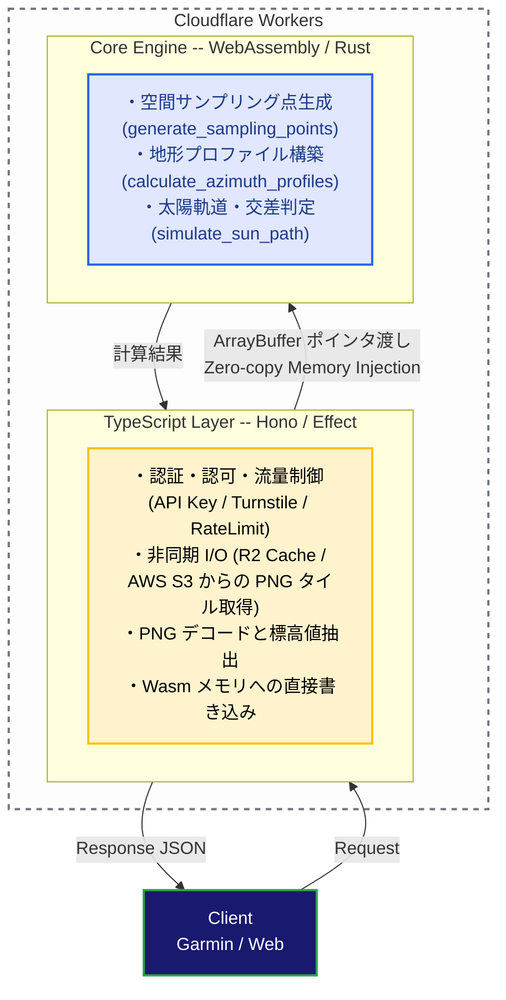

# ADR 003: コア計算エンジンへの WebAssembly (Rust) の採用

## コンテキスト

YAMAKAGE API は、ユーザーの現在地周辺（最大半径30km）の数万点に及ぶ地形データと太陽の軌道を掛け合わせ、山影に隠れる「真の日の入り・日の出時刻」をリアルタイムに計算する BFF（Backend For Frontends）サービスです。

初期の TypeScript のみによる実装では、以下の課題が生じていました。

### 1. **CPU バウンドな処理によるレイテンシ増大**:
- 放射状のサンプリング座標計算（数千〜数万点）
- 地球の曲率・大気差補正を加味した全方位の障害物最大仰角の走査
- 過去12時間〜未来48時間（計3,600分）にわたる分単位の太陽位置算出と線形補間交差判定
これら反復的かつ浮動小数点演算を多用する処理が V8 の CPU 時間を圧迫し、レスポンス速度の低下を招いていました。

### 2. **メモリ消費と GC（ガベージコレクション）のオーバーヘッド**:
- 大量の座標オブジェクト（`{ lat, lng }` 等）の生成・破棄が頻発し、GC によるスパイクが発生していました。

### 3. **Cloudflare Workers の CPU 時間制限**:
- サーバーレス環境特有の CPU 時間制約（標準プランのミリ秒制限）を安全に下回り、高負荷時でも安定稼働させる必要がありました。

### 4. **エッジサーバーレス環境における JIT コンパイルの限界**:

- V8 エンジンの JIT コンパイラは、長時間稼働するプロセスにおいて実行時プロファイリングに基づく高度な最適化を行いますが、短寿命な Isolate でリクエストごとに実行される Cloudflare Workers のような環境では、JIT のウォームアップが十分に完了せず、その優秀な最適化の恩恵を最大限に受けることができません。
また、JIT コンパイル処理自体も CPU 時間を消費する要因となっていました。

## 意思決定

計算処理と I/O 処理を明確に分離し、**CPU バウンドなコア計算エンジンを Rust で実装して WebAssembly (Wasm) にコンパイルするハイブリッド構成** を採用します。

### 1. 責務の明確な分離

#### **TypeScript 層 (Cloudflare Workers / Effect / Hono)**:
- リクエストの受付・バリデーション、認証、レートリミット。
- 非同期 I/O 処理（R2 バケットのキャッシュ走査、AWS Open Data からのタイル取得）。
- PNG タイル画像のデコードと Wasm メモリへのデータ注入。

#### **WebAssembly 層 (Rust / `yamakage-wasm`)**:
- 純粋関数的な高負荷数値計算に特化。外部通信（ネットワーク/ストレージ I/O）は一切行わない。
- `solar-positioning` クレート等を用いた高精度・高速な太陽位置計算。
- 連続メモリ（`SamplingArena`）を用いたキャッシュ効率の高いデータ走査。

### 2. Wasm メモリ直接共有によるオーバーヘッドの最小化

- TypeScript 側と Wasm 側で大きな JSON オブジェクトをシリアライズ/デシリアライズして受け渡す方式は採用せず、**ポインタを介したメモリ直接アクセス（`Float64Array`）** を採用。
- Wasm 内部で確保された座標バッファ（`lats_ptr`, `lngs_ptr`, `elevations_ptr`）に TypeScript 側から直接書き込むことで、プロセス間通信のオーバーヘッドをゼロに抑える。

### 3. CI/CD とビルド運用の最適化

- 一般的な `.gitignore` による `pkg/` 除外ではなく、ビルド済み Wasm アーティファクト（`yamakage-wasm/pkg/`）を Git 管理下に含める運用を採用。
- GitHub Actions などの CI/CD パイプラインで毎回 Rust ツールチェーンのセットアップや `wasm-pack` ビルドを行わずに済むため、デプロイ速度とビルドの再現性を大幅に向上させる。

## 結果と影響

### メリット

#### **エッジ環境に最適な AOT コンパイルの恩恵**:
- V8 の JIT コンパイルによる実行時最適化の恩恵を受けにくいサーバーレス環境において、事前コンパイル（AOT）された Rust (Wasm) は、初回実行時からネイティブに近いフルパフォーマンスを発揮します。
JIT ウォームアップの遅延やコンパイル自体のオーバーヘッドが排除され、より安定した高速処理が実現しました。

エッジ環境に最適な AOT コンパイルの恩恵と安全なスケールアップ:

ローカル環境における同一の重負荷条件で、TypeScript版とWasm版の純粋なCPU計算時間のパフォーマンステストを実施しました。

    テスト条件:

        ターゲット時刻: 2026-08-01T06:00:00.000Z

        計測座標: 36.2487, 137.6380 (北アルプス周辺)、35.3628, 138.7307 (富士山周辺)、35.0909, 138.8483 (沼津周辺)

        計算量: サンプリング数 30,241点 (Quality 2)、シミュレーションループ 3,600回 (-12時間〜+48時間)

        I/O: 全てキャッシュヒット状態とし、ネットワークI/O時間を除外した純粋なCPU計算時間のみを計測。

    テスト結果と考察:
    ローカル環境（wrangler dev）の常駐プロセスでは、V8エンジンのJIT最適化が極限まで効くため、TypeScript版が約28〜41ms、Wasm版が約46〜56msと、TS版の方がわずかに高速という結果になりました。
    しかし、リクエストごとに短命なコンテナが立ち上がる本番のエッジサーバーレス環境（Cloudflare Workers）では、JITのウォームアップが間に合いません。そのため、TS版のままでこれだけ巨大な計算量（30,241点）を本番デプロイすると、CPU稼働時間が長くなるはずです。
    事前コンパイル（AOT）された Rust (Wasm) を採用することで、JITが効かない本番のコールドなエッジ環境でも、初回リクエストからローカル計測時と全く同じフルパフォーマンス（約50ms）を確実に発揮できるようになりました。結果として、サンプリングポイント数を以前の1.7倍以上に引き上げても、安全かつ安定してレスポンスを返せる堅牢性を獲得しました。

#### **メモリ効率の向上と GC 削減**:
- `SamplingArena` による連続メモリ配置により、JavaScript ヒープ上での短命なオブジェクト生成が大幅に減少。

#### **高い計算精度の維持**:
- Rust の厳密な型システムと単体テスト（`cargo test`）により、エッジケース（白夜・極夜、無効座標、浮動小数点例外など）に対する信頼性が向上。

#### **サーバーレス適性の向上**:
- Cloudflare Workers の CPU 時間消費を極小化し、プラン上限やコスト面のリスクを低減。

### デメリット・トレードオフ

#### **開発フローの複雑化**:
- 計算ロジックを修正する場合、Rust コードの編集後にローカルで `pnpm run build:wasm` を実行して `pkg/` 差分を生成・コミットする必要がある。

#### **バイナリサイズの増加**:
- Wasm バイナリが Workers バンドルに含まれるため、デプロイ成果物のサイズが僅かに増加する（Workers の上限内には十分収まる）。

#### **デバッグの難易度**:
- Wasm 内部のランタイムパニックやメモリ不正アクセスは、純粋な TypeScript に比べてスタックトレースの追跡が難しくなるため、Rust 側での入念な入力バリデーション（`CalculationContext::try_new` 等）と Rust 単体テストの維持が不可欠。

## 代替案との比較

| 選択肢 | 評価 | 却下 / 採用理由 |
| --- | --- | --- |
| **TypeScript 単体での完全実装** | 却下 | 数万点のループ処理および分単位の交差シミュレーションにおいて CPU 時間制限とレイテンシの要件を満たせなかった。 |
| **Rust / Wasm 内での I/O (fetch) 完結** | 却下 | Wasm 内部からの非同期 fetch や Cloudflare バインディング（R2）の直接操作はコードが複雑化し、Workers のエコシステムとの親和性が落ちるため、I/O は TypeScript に任せる分離設計を選択。 |
| **外部計算サーバー (ECS/Lambda 等) へのオフロード** | 却下 | コールドスタートの発生、ネットワークホップによる追加遅延、インフラ管理コストの増加につながるため、エッジ内で完結する Wasm が最適と判断。 |