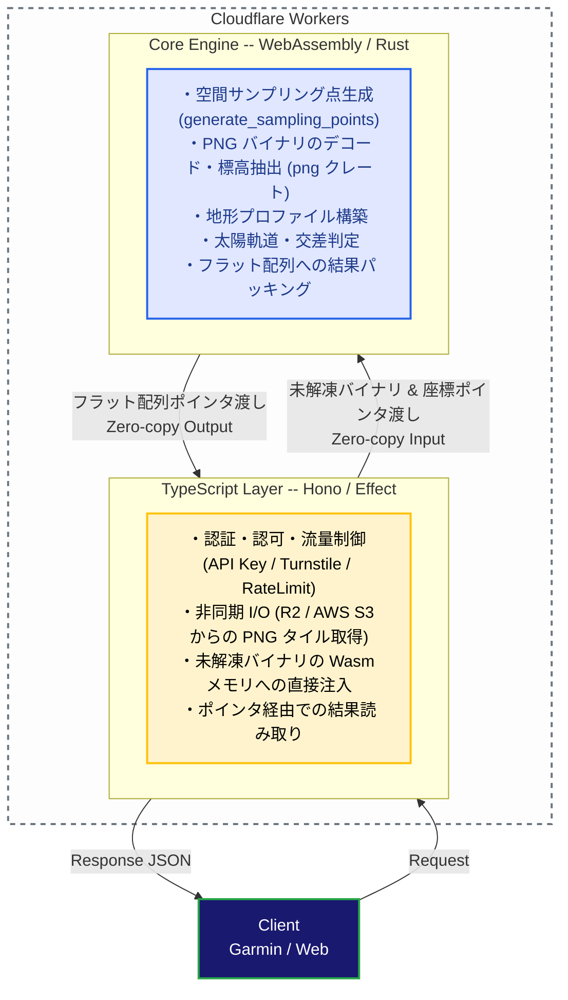

# ADR 003: コア計算エンジンへの WebAssembly (Rust) の採用

## コンテキスト

YAMAKAGE API は、ユーザーの現在地周辺（最大半径30km）の数万点に及ぶ地形データと太陽の軌道を掛け合わせ、山影に隠れる「真の日の入り・日の出時刻」をリアルタイムに計算する BFF（Backend For Frontends）サービスです。

初期の TypeScript のみによる実装、および初期の WebAssembly 導入フェーズにおいて、以下の課題が生じていました。

### 1. **CPU バウンドな処理とシリアライズによるレイテンシ増大**:

- 放射状のサンプリング座標計算（数千〜数万点）と全方位の障害物最大仰角の走査、および分単位の太陽位置算出。
- JS側での `fast-png` を用いた60枚以上のPNGタイル画像の並列デコード処理。
- 計算結果を Wasm から TypeScript へ返す際の `serde` による巨大な JSON オブジェクトツリーへのシリアライズ/デシリアライズ処理。
これら反復的かつ浮動小数点演算を多用する処理が V8 エンジンの CPU 時間を激しく圧迫し、レスポンス速度の低下を招いていました。

### 2. **メモリ消費と GC のオーバーヘッド**:
- JS側での巨大なピクセル配列（`Uint8Array`）の生成、および文字列キーベースの `Map` オブジェクトの構築・破棄がリクエストのたびに何百万回と頻発し、GC によるスパイクとメモリの膨張が発生していました。

### 3. **Cloudflare Workers の CPU 時間・メモリ制限**:

- サーバーレス環境特有の CPU 時間制約を少しでも節約する必要がありました。
- また、1コンテナ（Isolate）あたりのメモリ上限（128MB）に対して、アクセススパイク時の OOM（Out of Memory）リスクを排除する必要がありました。

### 4. **エッジサーバーレス環境における JIT コンパイルの限界**:

- V8 エンジンの JIT コンパイラは非常に優秀ですが、短寿命な Isolate でリクエストごとに実行される Cloudflare Workers のような環境ではウォームアップが十分に完了せず、ローカル環境のような極限の最適化の恩恵を受けることができません。

## 意思決定

計算処理と I/O 処理を明確に分離し、**CPU バウンドなコア計算エンジンおよび画像デコード処理を Rust で実装し、JS と Wasm 間を入出力ともに「完全ゼロコピー」で連携するアーキテクチャ** を採用します。

### 1. 責務の明確な極限分離

#### **TypeScript 層 (Cloudflare Workers / Effect / Hono)**:

* ネットワーク I/O とルーティングに徹する「土管」としての役割のみを担う。
* R2 や AWS から取得した PNG タイル画像は、JS側でデコードせず、未解凍の生バイナリ（`ArrayBuffer`）のまま Wasm に横流しする。

#### **WebAssembly 層 (Rust / `yamakage-wasm`)**:

* 純粋関数的な高負荷数値計算に加えて、**PNG画像の解凍・デコード処理** も担当する。
* 外部パッケージへの依存を最小限にし、`png` クレートを用いた高速なバイナリ解析と、`solar-positioning` クレートを用いた高精度な天体計算を行う。

### 2. Wasm メモリの完全な共有によるオーバーヘッドの排除

* **入力のゼロコピー:** TypeScript 側の `Map` 構築やループ検索を廃止し、座標インデックスと生のPNGバイナリを直接 Wasm のバッファ（`io_u8_buffer`, `io_u32_buffer`）に書き込む。
* **出力のゼロコピー:** `serde-wasm-bindgen` を用いた JS オブジェクトへのシリアライズを完全に廃止。Rust 側で計算結果をヘッダ付きの1次元 `Float64Array` にパッキングし、TypeScript 側はそのメモリアドレス（ポインタ）から直接数値を読み取る設計に変更。

### 3. CI/CD とビルド運用の最適化

* 一般的な `.gitignore` による `pkg/` 除外ではなく、ビルド済み Wasm アーティファクト（`yamakage-wasm/pkg/`）を Git 管理下に含める運用を採用。
* GitHub Actions などの CI/CD パイプラインで毎回 Rust ツールチェーンのセットアップや `wasm-pack` ビルドを行わずに済むため、デプロイ速度とビルドの再現性を大幅に向上させる。

## 結果と影響

### メリット

#### **エッジ環境における CPU 時間の劇的な削減（3〜5倍の高速化）**:

* TypeScript版（`fast-png` ＋ JSループ）では本番環境で **約1,100ms 〜 2,000ms** に達していた CPU 稼働時間が、Wasm 完全ゼロコピー版の導入により **約250ms 〜 500ms** へと激減しました。
* JIT ウォームアップが効かないコールドスタート時においても、AOT コンパイルされた Rust が初回からネイティブに近いフルパフォーマンスを発揮し、CPU 制限によるタイムアウトのリスクを削減しました。

#### **メモリ消費の半減と GC の抑圧**:

* JSヒープ上での巨大な `Uint8Array` や一時オブジェクトの生成が消滅したため、通常時（P50）のメモリ使用量が **約41.8MB から 約23.9MB へ（約43%減）** 大幅に改善されたことを確認できました。
* コンテナのメモリ上限（128MB）に対する莫大な安全マージンが確保され、スパイク時の安定性とコンテナの生存率（キャッシュのヒット率）が向上しました。

#### **高い計算精度の維持と安全性**:

* Rust の厳密な型システムにより、Wasm メモリの境界チェックやアクセス違反がコンパイル時に保護され、堅牢な BFF バックエンドが実現しました。

### デメリット・トレードオフ

#### **バイナリサイズの増加**:

* Wasm 内部に `png` デコード処理を含めたため、Wasm バイナリサイズが数百KB程度増加しました（Workers のスクリプトサイズ上限内には余裕で収容可能）。

#### **境界インターフェースの複雑化**:

* Wasm と TS 間で直接メモリを読み書きするため、バイトオフセットの計算やフラットな配列へのパッキング/アンパッキングロジックを手動で管理・維持する必要があります。

#### **開発フローの複雑化**:

* 計算ロジックを修正する場合、Rust コードの編集後にローカルで `pnpm run build:wasm` を実行して `pkg/` 差分を生成・コミットする必要があります。

## 代替案との比較

| 選択肢 | 評価 | 却下 / 採用理由 |
| --- | --- | --- |
| **TypeScript 単体での完全実装** | 却下 | 数万点のループ処理およびPNG画像の並列デコードにおいて、Cloudflare Workers の CPU 時間制限とメモリ制約に不安が残る。|
| **Rust / Wasm 内での I/O (fetch) 完結** | 却下 | Wasm 内部からの非同期 fetch や Cloudflare バインディング（R2/KV）の直接操作はコードが複雑化し、Workers エコシステムとの親和性が落ちるため、I/O は TypeScript に任せる分離設計を選択。 |
| **外部計算サーバー (ECS/Lambda 等) へのオフロード** | 却下 | ネットワークホップによる追加遅延、インフラ管理コストの増加につながるため、エッジ内で処理が完結する Wasm 構成が最適と判断。 |