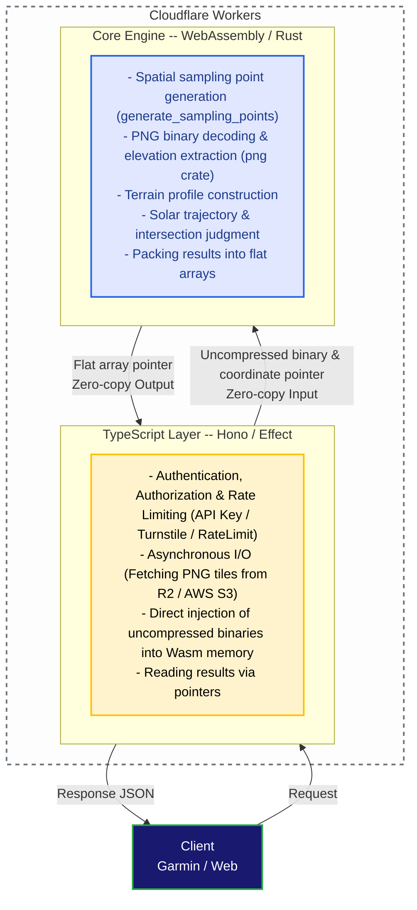

# ADR 003: Adoption of WebAssembly (Rust) for the Core Calculation Engine

## Context

YAMAKAGE API is a BFF (Backend For Frontends) service that calculates the "true sunset and sunrise times" hidden behind mountain shadows in real-time by combining tens of thousands of terrain data points within a 30km radius of the user's current location with solar trajectories.

In the initial TypeScript-only implementation and the early WebAssembly adoption phase, the following challenges arose:

### 1. **Increased Latency Due to CPU-Bound Processing and Serialization**:

- Radial sampling coordinate calculations (thousands to tens of thousands of points), scanning for the maximum obstacle elevation angle in all directions, and minute-by-minute solar position calculations.
- Parallel decoding of over 60 PNG tile images using `fast-png` on the JS side.
- Serialization and deserialization processing into giant JSON object trees via `serde` when returning calculation results from Wasm to TypeScript.
- These repetitive and floating-point-intensive operations heavily strained the V8 engine's CPU time, causing response speed degradation.

### 2. **Memory Consumption and GC Overhead**:

- Generation of huge pixel arrays (`Uint8Array`) on the JS side, along with millions of string-key-based `Map` object constructions and destructions per request, caused GC spikes and memory expansion.

### 3. **Cloudflare Workers CPU Time and Memory Limits**:

- The need to strictly conserve CPU time constraints unique to serverless environments.
- Eliminating Out of Memory (OOM) risks during access spikes against the memory limit per container (Isolate) of 128MB.

### 4. **Limits of JIT Compilation in Edge Serverless Environments**:

- While the V8 engine's JIT compiler is highly efficient, environments like Cloudflare Workers—where short-lived Isolates execute per request—do not allow sufficient warmup time to benefit from the extreme optimizations seen in local environments.

## Decision

We will clearly separate computational and I/O processes, adopting an architecture where **the CPU-bound core calculation engine and image decoding process are implemented in Rust, with JS and Wasm interacting via a completely "zero-copy" approach for both input and output**.

### 1. Clear Separation of Responsibilities

#### **TypeScript Layer (Cloudflare Workers / Effect / Hono)**:

- Acts strictly as a "pipeline" dedicated to network I/O and routing.
- PNG tile images fetched from R2 or AWS are not decoded on the JS side; they are passed directly to Wasm as uncompressed raw binaries (`ArrayBuffer`).

#### **WebAssembly Layer (Rust / `yamakage-wasm`)**:

- Handles pure functional, high-load numerical computations as well as **PNG image unpacking and decoding**.
- Minimizes external package dependencies, utilizing the `png` crate for high-speed binary parsing and the `solar-positioning` crate for high-precision astronomical calculations.

### 2. Elimination of Overhead Through Complete Sharing of Wasm Memory

- **Zero-Copy Input:** Eliminating TypeScript-side `Map` constructions and loop lookups by writing coordinate indices and raw PNG binaries directly into Wasm buffers (`io_u8_buffer`, `io_u32_buffer`).
- **Zero-Copy Output:** Completely removing serialization into JS objects using `serde-wasm-bindgen`. The Rust side packs calculation results into a header-equipped 1D `Float64Array`, allowing the TypeScript side to read values directly from that memory address (pointer).

### 3. Optimization of CI/CD and Build Operations

- Adopting a workflow that includes pre-built Wasm artifacts (`yamakage-wasm/pkg/`) under Git version control, rather than excluding `pkg/` via standard `.gitignore`.
- Eliminating the need to set up the Rust toolchain or run `wasm-pack` builds in CI/CD pipelines like GitHub Actions, significantly improving deployment speed and build reproducibility.

## Results and Impact

### Pros

#### **Dramatic Reduction of CPU Time in Edge Environments (3x to 5x Acceleration)**:

- CPU runtime, which reached approximately **1,100ms to 2,000ms** in production with the TypeScript version (`fast-png` + JS loops), plummeted to **approximately 250ms to 500ms** with the zero-copy Wasm implementation.
- Even during cold starts where JIT warmup is ineffective, AOT-compiled Rust delivers near-native peak performance from the first invocation, reducing timeout risks caused by CPU limits.

#### **Halving Memory Consumption and Suppressing GC**:

- The elimination of massive `Uint8Array` allocations and temporary object creation on the JS heap reduced normal-state (P50) memory usage from **approximately 41.8MB to 23.9MB (about a 43% reduction)**.
- A massive safety margin against the 128MB container memory limit was secured, improving stability during spikes and container survival rates (cache hit rates).

#### **Maintenance of High Calculation Accuracy and Safety**:

- Rust's rigorous type system protects against Wasm memory boundary violations and access errors at compile time, realizing a robust BFF backend.

### Cons / Trade-offs

#### **Increase in Binary Size**:

- Including PNG decoding processing inside Wasm increased the Wasm binary size by several hundred KB (comfortably within the Worker script size limits).

#### **Increased Complexity of Boundary Interfaces**:

- Because Wasm and TS directly read and write memory, byte offset calculations and flat array packing/unpacking logic must be manually managed and maintained.

#### **Complication of Development Flow**:

- Modifying computation logic requires running `pnpm run build:wasm` locally after editing Rust code to generate and commit `pkg/` diffs.

## Comparison with Alternatives

| Option | Evaluation | Reason for Rejection / Adoption |
| --- | --- | --- |
| **Complete implementation in TypeScript alone** | Rejected | Concerns remain regarding Cloudflare Workers' CPU time and memory constraints during tens of thousands of loop iterations and parallel PNG decoding. |
| **Complete I/O (fetch) execution within Rust / Wasm** | Rejected | Asynchronous fetches or direct Cloudflare bindings (R2/KV) inside Wasm complicate code and reduce affinity with the Workers ecosystem, so I/O is left to TypeScript. |
| **Offloading to an external computation server (ECS/Lambda, etc.)** | Rejected | Leads to additional latency from network hops and increased infrastructure management costs; an edge-contained Wasm architecture was deemed optimal. |