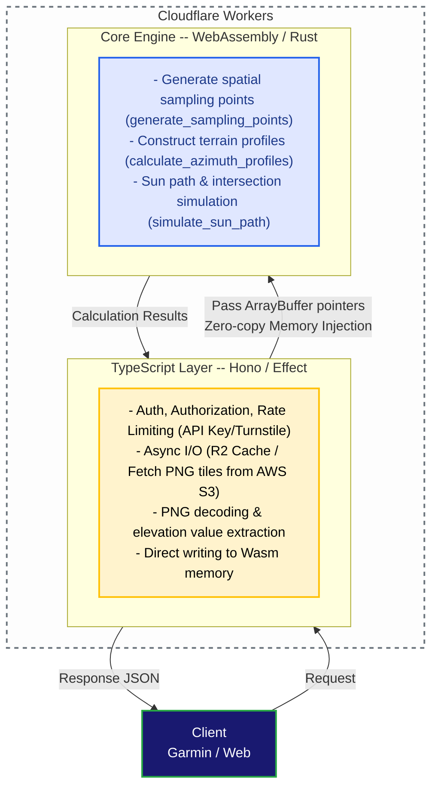

# ADR 003: Adoption of WebAssembly (Rust) for the Core Calculation Engine

## Context

The YAMAKAGE API is a BFF (Backend For Frontends) service that calculates the "true sunset and sunrise times" hidden by mountain shadows in real-time. It does this by combining the sun's trajectory with tens of thousands of terrain data points around the user's current location (up to a 30km radius).

In the initial implementation using only TypeScript, the following issues arose:

### 1. **Increased Latency Due to CPU-Bound Processing**:

- Calculation of radial sampling coordinates (thousands to tens of thousands of points).
- Scanning for the maximum obstacle elevation angle in all directions, accounting for Earth's curvature and atmospheric refraction.
- Minute-by-minute calculation of the sun's position and linear interpolation intersection detection over a period spanning 12 hours in the past to 48 hours in the future (3,600 minutes total).
These highly repetitive and floating-point-intensive operations strained the V8 engine's CPU time, leading to degraded response speeds.

### 2. **Memory Consumption and GC (Garbage Collection) Overhead**:

- The frequent creation and destruction of massive amounts of coordinate objects (e.g., `{ lat, lng }`) caused GC spikes.

### 3. **Cloudflare Workers CPU Time Limits**:

- It was necessary to safely stay below the CPU time constraints typical of serverless environments (millisecond limits on standard plans) to ensure stable operation even under heavy load.

### 4. **Limitations of JIT Compilation in Edge Serverless Environments**:

- The V8 engine's JIT compiler performs advanced optimizations based on runtime profiling in long-running processes. However, in environments like Cloudflare Workers, where code is executed per request in short-lived Isolates, JIT warm-up is rarely completed, preventing the system from fully benefiting from these excellent optimizations. Furthermore, the JIT compilation process itself consumed CPU time.

## Decision

We clearly separated computational processing from I/O processing and adopted a **hybrid architecture where the CPU-bound core calculation engine is implemented in Rust and compiled to WebAssembly (Wasm)**.

### 1. Clear Separation of Concerns

#### **TypeScript Layer (Cloudflare Workers / Effect / Hono)**:
- Request reception, validation, authentication, and rate limiting.
- Asynchronous I/O processing (scanning the R2 bucket cache, fetching tiles from AWS Open Data).
- Decoding PNG tile images and injecting data into Wasm memory.

#### **WebAssembly Layer (Rust / `yamakage-wasm`)**:
- Specializes in pure, highly-intensive numerical calculations. It performs no external communication (network/storage I/O).
- High-precision, high-speed sun position calculations using crates like `solar-positioning`.
- Cache-efficient data scanning using contiguous memory (`SamplingArena`).

### 2. Overhead Minimization via Direct Wasm Memory Sharing

- Instead of serializing/deserializing large JSON objects to pass between TypeScript and Wasm, we adopted **direct memory access via pointers (`Float64Array`)**.
- By writing directly from the TypeScript side into coordinate buffers allocated inside Wasm (`lats_ptr`, `lngs_ptr`, `elevations_ptr`), the inter-process communication overhead is reduced to zero.

### 3. CI/CD and Build Operations Optimization

* Instead of the common practice of excluding `pkg/` via `.gitignore`, we adopted a workflow where pre-built Wasm artifacts (`yamakage-wasm/pkg/`) are included in Git version control.
* This eliminates the need to set up the Rust toolchain and run `wasm-pack` builds during every CI/CD pipeline run (e.g., GitHub Actions), significantly improving deployment speed and build reproducibility.

## Consequences

### Positive

Here is the English translation of your text:

#### **Benefits of AOT Compilation Ideal for Edge Environments**:

- In serverless environments, which struggle to benefit from the runtime optimizations of V8's JIT compilation, pre-compiled (AOT) Rust (Wasm) delivers near-native full performance from the very first execution. By eliminating JIT warm-up delays and compilation overhead, we have achieved highly stable, high-speed processing.

Benefits of AOT Compilation for Edge Environments and Safe Scaling:

We conducted performance testing under identical heavy-load conditions in a local environment to compare the pure CPU computation times of the TypeScript and Wasm versions.

Test Conditions:

    Target Time: 2026-08-01T06:00:00.000Z

    Measurement Coordinates: 36.2487, 137.6380 (around the Northern Alps), 35.3628, 138.7307 (around Mt. Fuji), 35.0909, 138.8483 (around Numazu)

    Computational Load: 30,241 sampling points (Quality 2), 3,600 simulation loops (-12 hours to +48 hours)

    I/O: All requests resulted in cache hits; only pure CPU computation time was measured, excluding network I/O.

Test Results and Discussion:
In a continuously running local environment (`wrangler dev`), V8's JIT optimization operates at maximum efficiency. Consequently, the TypeScript version slightly outperformed the Wasm version, recording ~28–41ms compared to Wasm's ~46–56ms.
However, in the production edge serverless environment (Cloudflare Workers)—where short-lived containers are spun up per request—there is insufficient time for JIT warm-up. Therefore, deploying such a massive computational load (30,241 points) to production using the TypeScript version would inevitably lead to prolonged CPU execution times.
By adopting Ahead-of-Time (AOT) compiled Rust (Wasm), we ensure that the application consistently delivers the exact same full performance (~50ms) as measured locally from the very first request, even in cold production edge environments where JIT provides no benefit. As a result, we have achieved the robustness needed to safely and consistently return responses, even after increasing the number of sampling points by over 1.7 times compared to the previous setup.

#### **Computational Performance**:

- The calculation time for spatial sampling and sun trajectory simulation has been reduced to sub-millisecond to single-digit millisecond order.

#### **Improved Memory Efficiency and GC Reduction**:

- Contiguous memory allocation using `SamplingArena` drastically reduced the creation of short-lived objects on the JavaScript heap.

#### **Maintained High Calculation Accuracy**:

- Rust's strict type system and unit tests (`cargo test`) have improved reliability against edge cases (e.g., midnight sun, polar night, invalid coordinates, floating-point exceptions).

#### **Improved Serverless Aptitude**:

- Cloudflare Workers CPU time consumption was minimized, reducing risks related to plan limits and costs.

### Negative / Trade-offs

#### **Increased Development Flow Complexity**:
- When modifying calculation logic, developers must run `pnpm run build:wasm` locally after editing Rust code to generate and commit the `pkg/` diffs.

#### **Increased Binary Size**:
- Including the Wasm binary in the Workers bundle slightly increases the deployment artifact size (though it remains well within the Workers limits).

#### **Debugging Difficulty**:
- Runtime panics and invalid memory access inside Wasm are harder to trace via stack traces compared to pure TypeScript. Therefore, rigorous input validation on the Rust side (like `CalculationContext::try_new`) and maintaining Rust unit tests are essential.

## Alternatives Considered

| Option | Evaluation | Reason for Rejection / Adoption |
| --- | --- | --- |
| **Full implementation in TypeScript only** | Rejected | Failed to meet CPU time limits and latency requirements during loop processing of tens of thousands of points and minute-by-minute intersection simulations. |
| **Self-contained I/O (fetch) within Rust / Wasm** | Rejected | Asynchronous fetching and direct manipulation of Cloudflare bindings (R2) from within Wasm complicates the code and reduces compatibility with the Workers ecosystem. We chose a separated design leaving I/O to TypeScript. |
| **Offloading to an external calculation server (ECS/Lambda, etc.)** | Rejected | Leads to cold starts, additional latency from network hops, and increased infrastructure management costs. Concluded that an edge-contained Wasm solution is optimal. |