# YAMAKAGE Wasm Zero-Copy データフロードキュメント

このドキュメントは、TypeScript（Cloudflare Workers）と WebAssembly（Rust）間で行われるゼロコピーのデータ受け渡しフローと、共有メモリの構造を定義します。

## 1. 全体データフロー（シーケンス図）

TypeScriptとWasmは、JSONのシリアライズ/デシリアライズを行わず、**「Wasmが確保したメモリ領域（バッファ）の開始アドレス（ポインタ）」** を介して直接データの読み書きを行います。

```mermaid
sequenceDiagram
    autonumber
    participant Client
    participant TS as TypeScript (Workers)
    participant Mem as Wasm Shared Memory
    participant Rust as WebAssembly (Rust)

    Client->>TS: GET/POST Request (lat, lng, time)
    
    rect rgb(70, 128, 214)
    Note right of TS: 1. サンプリング座標の生成と読み取り
    TS->>Rust: generate_sampling_points(lat, lng, stepDeg)
    Rust->>Mem: 座標(lats, lngs)をメモリに書き込み
    Rust-->>TS: pointCount を返す
    TS->>Mem: get_lats_ptr() / get_lngs_ptr() で直接読み取り
    end

    rect rgb(212, 102, 28)
    Note right of TS: 2. 画像デコードと標高抽出
    TS->>TS: R2 / AWS から PNGバイナリを取得
    TS->>Mem: 生のPNGバイナリを書き込み (io_u8_buffer)
    TS->>Mem: 座標・ピクセル対応表を書き込み (io_u32_buffer)
    TS->>Rust: decode_tile_elevations()
    Rust->>Mem: バイナリを解凍し、標高データを内部Arenaに保存
    end

    rect rgb(8, 44, 8)
    Note right of TS: 3. 太陽軌道と山影の計算・結果取得
    TS->>Rust: calculate_shadow()
    Rust->>Mem: 計算結果を Float64Array (1次元配列) にパッキング
    Rust-->>TS: result_ptr (配列の先頭ポインタ) を返す
    TS->>Mem: result_ptr から Float64Array としてデータを解析
    end

    TS->>Client: JSON Response

```

---

## 2. 入力データのメモリ構造 (TS -> Wasm)

タイル画像を取得した際、TSはデコード処理をRustに委譲するため、**「未解凍のPNGバイナリ」** と **「どのピクセルを読むべきか」** をWasmメモリに直接流し込みます。

### A. PNGバイナリバッファ (`io_u8_buffer`)

* **用途:** R2やAWSから取得した `ArrayBuffer` をそのままコピーする領域。
* **型:** `Uint8Array` (1バイト単位)
* **書き込み方:** `engine.get_io_u8_ptr(size)` でポインタを取得し、TS側で TypedArray を被せて上書きする。

### B. ピクセルマッピングバッファ (`io_u32_buffer`)

* **用途:** 画像内のどの座標（X, Y）の標高を、Wasm内部配列のどのインデックスに保存するかを指示するリスト。
* **型:** `Uint32Array` (4バイト単位)
* **構造:** 1ポイントにつき **3つの数値** を連続して書き込む。

| オフセット | 格納する値 | 意味 |
| --- | --- | --- |
| `i * 3` | `index` | TS側でのポイント番号（0 = 現在地、1〜 = 周辺座標） |
| `i * 3 + 1` | `px` | タイル画像内の X 座標ピクセル (0〜255) |
| `i * 3 + 2` | `py` | タイル画像内の Y 座標ピクセル (0〜255) |

---

## 3. 出力データのメモリ構造 (Wasm -> TS)

Rust側で計算された複雑な構造体（`ShadowResultWasm`）は、TSへ渡す前に `types.rs` の `pack_into_buffer` メソッドによって **単一の1次元配列（`Float64Array`）** に平坦化（パッキング）されます。
TS側はこの配列のフォーマットを知っている前提で、ポインタ（`resultPtr`）からオフセットを計算してデータを取り出します。

### 配列の全体レイアウト

メモリ上には以下の順序で隙間なく `Float64` (8バイト) の数値が並びます。

#### [ブロック1] ヘッダ領域（固定: 8要素）

| インデックス | 内容 | 備考 |
| --- | --- | --- |
| `0` | `is_polar` | 極夜/白夜フラグ（`1.0` = true, `0.0` = false） |
| `1` | `sunset_time_unix` | 日の入り時刻（Unix秒） |
| `2` | `minutes_to_sunset` | 日の入りまでの残り分数 |
| `3` | `sunrise_time_unix` | 日の出時刻（Unix秒） |
| `4` | `minutes_to_sunrise` | 日の出までの残り分数 |
| `5` | `num_profiles` (**N**) | 地形プロファイル（方位データ）の件数 |
| `6` | `num_sun_path` (**M**) | 太陽軌道ポイントの件数 |
| `7` | `padding` | 予約領域（常に `0.0`） |

#### [ブロック2] 地形プロファイル配列（サイズ: `N * 5` 要素）

*開始オフセット:* `8`

方位データの数（N）だけ、1件につき **5要素** が連続して格納されます。

| オフセット (1件あたり) | 内容 | 備考 |
| --- | --- | --- |
| `i * 5` | `azimuth_deg` | 方位角（度） |
| `i * 5 + 1` | `max_obstacle_angle_deg` | 最大障害物仰角（度） |
| `i * 5 + 2` | `lat` | 最高地点の緯度（無い場合は `NaN`） |
| `i * 5 + 3` | `lng` | 最高地点の経度（無い場合は `NaN`） |
| `i * 5 + 4` | `highest_altitude` | 最高地点の標高 |

#### [ブロック3] 太陽軌道配列（サイズ: `M * 3` 要素）

*開始オフセット:* `8 + (N * 5)`

太陽軌道のポイント数（M）だけ、1件につき **3要素** が連続して格納されます。

| オフセット (1件あたり) | 内容 | 備考 |
| --- | --- | --- |
| `i * 3` | `time` | 時刻（Unix秒） |
| `i * 3 + 1` | `azimuth` | 太陽の方位角（度） |
| `i * 3 + 2` | `altitude` | 太陽の仰角（度） |

---

## 4. 開発・メンテナンス時の注意点 (Gotchas)

### 1. **データ構造の変更時は両方の更新が必須**
* Wasm側（`yamakage-wasm/src/schemas/ShadowResultWasm.rs` の `pack_into_buffer`）で返す要素を1つでも追加・削除した場合、**必ず TypeScript側（`CalculateShadowUseCase.ts` のアンパッキングループ）のオフセット計算式も合わせて修正** してください。これを怠ると、データがずれて全く無関係の数値がパースされます。

### 2. **`NaN` によるエラー判定と Nullable の表現**
* CやRustと異なり、`Float64Array` には「値がない（`null` や `undefined`）」という概念がありません。そのため、計算エラー時や、最高地点（`highestPoint`）が存在しない場合は、代替として **`NaN` (Not a Number)** を詰め込んでいます。TS側では `Number.isNaN()` で判定して処理を分岐させてください。

### 3. **メモリの自動拡張による TypedArray の無効化**
* Wasmの内部メモリは、データ量が増えるとOSのように動的に拡張（Grow）されます。メモリが拡張された瞬間、古い `memory.buffer` を参照していた JS 側の `Float64Array` は**参照切れ（Detached ArrayBuffer）を起こしクラッシュします。**
* これを防ぐため、TS側では**ポインタを受け取るたびに、必ず `new Float64Array(wasm.memory.buffer, ...)` と再定義して最新のバッファを参照する** ように実装されています。既存の配列変数を使い回さないでください。