# YAMAKAGE Wasm Zero-Copy Data Flow Document

This document defines the "completely zero-copy" data transfer flow and the structure of the shared memory (Linear Memory) between TypeScript (Cloudflare Workers) and WebAssembly (Rust).

## 1. Overall Data Flow (Sequence Diagram)

TypeScript and Wasm do not perform JSON serialization/deserialization. Instead, they directly read and write data via **"the starting address (pointer) of the memory region (buffer) allocated by Wasm."**

```mermaid
sequenceDiagram
    autonumber
    participant Client
    participant TS as TypeScript (Workers)
    participant Mem as Wasm Shared Memory
    participant Rust as WebAssembly (Rust)

    Client->>TS: GET/POST Request (lat, lng, time)
    
    rect rgb(70, 128, 214)
    Note right of TS: 1. Generation and reading of sampling coordinates
    TS->>Rust: generate_sampling_points(lat, lng, stepDeg)
    Rust->>Mem: Write coordinates (lats, lngs) to memory
    Rust-->>TS: Return pointCount
    TS->>Mem: Directly read via get_lats_ptr() / get_lngs_ptr()
    end

    rect rgb(212, 102, 28)
    Note right of TS: 2. Image decoding and elevation extraction
    TS->>TS: Fetch PNG binary from R2 / AWS
    TS->>Mem: Write raw PNG binary (io_u8_buffer)
    TS->>Mem: Write coordinate-to-pixel mapping table (io_u32_buffer)
    TS->>Rust: decode_tile_elevations()
    Rust->>Mem: Decompress binary and save elevation data to internal Arena
    end

    rect rgb(8, 44, 8)
    Note right of TS: 3. Calculation of solar trajectory and mountain shadows, and result retrieval
    TS->>Rust: calculate_shadow()
    Rust->>Mem: Pack calculation results into Float64Array (1D array)
    Rust-->>TS: Return result_ptr (array head pointer)
    TS->>Mem: Parse data as Float64Array from result_ptr
    end

    TS->>Client: JSON Response

```

---

## 2. Input Data Memory Structure (TS -> Wasm)

When fetching tile images, TS delegates the decoding process to Rust. Therefore, it directly streams the **"uncompressed PNG binary"** and instructions on **"which pixels to read"** into the Wasm memory.

### A. PNG Binary Buffer (`io_u8_buffer`)

- **Purpose:** A region to directly copy the `ArrayBuffer` fetched from R2 or AWS.
- **Type:** `Uint8Array` (1-byte units)
- **How to write:** Obtain the pointer via `engine.get_io_u8_ptr(size)`, wrap it in a TypedArray on the TS side, and overwrite it.

### B. Pixel Mapping Buffer (`io_u32_buffer`)

- **Purpose:** A list indicating which coordinates (X, Y) in the image should have their elevations saved to which index in the internal Wasm array.
- **Type:** `Uint32Array` (4-byte units)
- **Structure:** Sequentially write **3 numeric values** per point.

| Offset | Stored Value | Meaning |
| --- | --- | --- |
| `i * 3` | `index` | Point number on the TS side (0 = current location, 1~ = surrounding coordinates) |
| `i * 3 + 1` | `px` | X coordinate pixel in the tile image (0-255) |
| `i * 3 + 2` | `py` | Y coordinate pixel in the tile image (0-255) |

---

## 3. Output Data Memory Structure (Wasm -> TS)

Complex structs (`ShadowResultWasm`) calculated on the Rust side are flattened (packed) into a **single 1D array (`Float64Array`)** via the `pack_into_buffer` method in `types.rs` before being passed to TS.
Assuming the TS side knows this array's format, it calculates offsets from the pointer (`resultPtr`) to extract the data.

### Overall Array Layout

The `Float64` (8 bytes) numbers are laid out contiguously in memory in the following order.

#### [Block 1] Header Region (Fixed: 8 elements)

| Index | Content | Notes |
| --- | --- | --- |
| `0` | `is_polar` | Polar night/Midnight sun flag (`1.0` = true, `0.0` = false) |
| `1` | `sunset_time_unix` | Sunset time (Unix seconds) |
| `2` | `minutes_to_sunset` | Minutes remaining until sunset |
| `3` | `sunrise_time_unix` | Sunrise time (Unix seconds) |
| `4` | `minutes_to_sunrise` | Minutes remaining until sunrise |
| `5` | `num_profiles` (**N**) | Number of terrain profiles (azimuth data) |
| `6` | `num_sun_path` (**M**) | Number of solar trajectory points |
| `7` | `padding` | Reserved area (always `0.0`) |

#### [Block 2] Terrain Profile Array (Size: `N * 5` elements)

*Starting Offset:* `8`

For each of the (N) azimuth data entries, **5 elements** are stored sequentially.

| Offset (per entry) | Content | Notes |
| --- | --- | --- |
| `i * 5` | `azimuth_deg` | Azimuth angle (degrees) |
| `i * 5 + 1` | `max_obstacle_angle_deg` | Maximum obstacle elevation angle (degrees) |
| `i * 5 + 2` | `lat` | Latitude of the highest point (`NaN` if none) |
| `i * 5 + 3` | `lng` | Longitude of the highest point (`NaN` if none) |
| `i * 5 + 4` | `highest_altitude` | Altitude of the highest point |

#### [Block 3] Solar Trajectory Array (Size: `M * 3` elements)

*Starting Offset:* `8 + (N * 5)`

For each of the (M) solar trajectory points, **3 elements** are stored sequentially.

| Offset (per entry) | Content | Notes |
| --- | --- | --- |
| `i * 3` | `time` | Time (Unix seconds) |
| `i * 3 + 1` | `azimuth` | Solar azimuth angle (degrees) |
| `i * 3 + 2` | `altitude` | Solar elevation angle (degrees) |

---

## 4. Development and Maintenance Considerations (Gotchas)

### 1. **Updating both sides is mandatory when modifying data structures**

- If you add or remove even a single returned element on the Wasm side (`pack_into_buffer` in `yamakage-wasm/src/types.rs`), **you must also update the offset calculation formulas on the TypeScript side (the unpacking loop in `CalculateShadowUseCase.ts`) accordingly.** Failing to do so will shift the data, resulting in completely unrelated numbers being parsed.

### 2. **Error handling and representation of Nullable via `NaN**`

- Unlike C or Rust, `Float64Array` does not have a concept of "no value" (like `null` or `undefined`). Therefore, in the event of a calculation error, or when the highest point (`highestPoint`) does not exist, **`NaN` (Not a Number)** is packed as a substitute. Branch your logic on the TS side by checking with `Number.isNaN()`.

### 3. **Invalidation of TypedArray due to automatic memory expansion**

- Wasm's internal memory dynamically expands (grows) as data volume increases, much like an OS. The moment memory is expanded, `Float64Array` instances on the JS side pointing to the old `memory.buffer` will **suffer from a detached buffer (Detached ArrayBuffer) and crash.**
- To prevent this, it is implemented such that on the TS side, **every time a pointer is received, it is always redefined using `new Float64Array(wasm.memory.buffer, ...)` to reference the latest buffer.** Do not reuse existing array variables.