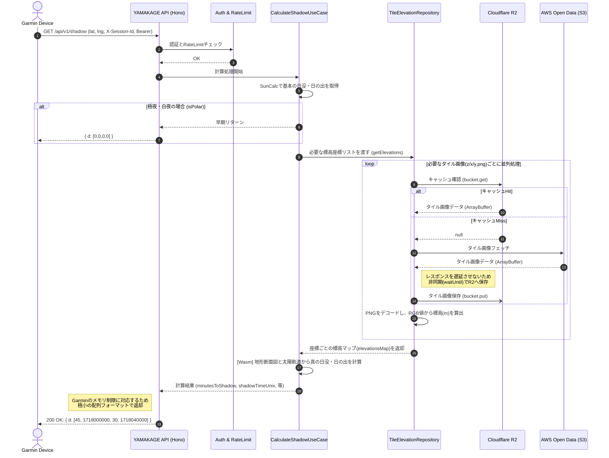
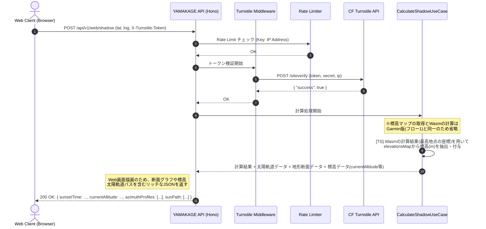

# データフロー図

## コア機能

```mermaid
sequenceDiagram
    autonumber
    
    actor Garmin as Garmin Device
    participant API as YAMAKAGE API (Hono)
    participant Auth as Auth & RateLimit
    participant Usecase as CalculateShadowUseCase
    participant Repo as TileElevationRepository
    participant R2 as Cloudflare R2
    participant AWS as AWS Open Data (S3)

    Garmin->>API: GET /api/v1/shadow (lat, lng, X-Session-Id, Bearer)
    
    API->>Auth: 認証とRateLimitチェック
    Auth-->>API: OK
    
    API->>Usecase: 計算処理開始
    
    Usecase->>Usecase: SunCalcで基本の日没・日の出を取得
    alt 極夜・白夜の場合 (isPolar)
        Usecase-->>API: 早期リターン
        API-->>Garmin: { d: [0,0,0,0] }
    end
    
    Usecase->>Repo: 必要な標高座標リストを渡す (getElevations)
    
    loop 必要なタイル画像(z/x/y.png)ごとに並列処理
        Repo->>R2: キャッシュ確認 (bucket.get)
        alt キャッシュHit
            R2-->>Repo: タイル画像データ (ArrayBuffer)
        else キャッシュMiss
            R2-->>Repo: null
            Repo->>AWS: タイル画像フェッチ
            AWS-->>Repo: タイル画像データ (ArrayBuffer)
            
            note right of Repo: レスポンスを遅延させないため<br>非同期(waitUntil)でR2へ保存
            Repo-)R2: タイル画像保存 (bucket.put)
        end
        Repo->>Repo: PNGをデコードし、RGB値から標高(m)を算出
    end
    
    Repo-->>Usecase: 座標ごとの標高マップ(elevationsMap)を返却
    
    Usecase->>Usecase: [Wasm] 地形断面図と太陽軌道から真の日没・日の出を計算
    
    Usecase-->>API: 計算結果 (minutesToShadow, shadowTimeUnix, 等)
    
    note left of API: Garminのメモリ制限に対応するため<br>極小の配列フォーマットで返却
    API-->>Garmin: 200 OK: { d: [45, 1718000000, 30, 1718040000] }

```

## Web版

```mermaid
sequenceDiagram
    autonumber
    
    actor Web as Web Client (Browser)
    participant API as YAMAKAGE API (Hono)
    participant TurnstileMiddleware as Turnstile Middleware
    participant RateLimiter as Rate Limiter
    participant Cloudflare as CF Turnstile API
    participant Usecase as CalculateShadowUseCase

    Web->>API: POST /api/v1/web/shadow (lat, lng, X-Turnstile-Token)
    
    API->>RateLimiter: Rate Limit チェック (Key: IP Address)
    RateLimiter-->>API: OK
    
    API->>TurnstileMiddleware: トークン検証開始
    TurnstileMiddleware->>Cloudflare: POST /siteverify (token, secret, ip)
    Cloudflare-->>TurnstileMiddleware: { "success": true }
    TurnstileMiddleware-->>API: OK
    
    API->>Usecase: 計算処理開始
    
    note over Usecase: ※標高マップの取得とWasmの計算は<br>Garmin版(フロー1)と同一のため省略
    
    Usecase->>Usecase: [TS] Wasmの計算結果(最高地点の座標)を用いて<br>elevationsMapから標高(m)を抽出・付与
    
    Usecase-->>API: 計算結果 + 太陽軌道データ + 地形断面データ + 標高データ(currentAltitude等)
    
    note left of API: Web画面描画のため、断面グラフや標高<br>太陽軌道パスを含むリッチなJSONを返す
    API-->>Web: 200 OK: { sunsetTime: ..., currentAltitude: ..., azimuthProfiles: [...], sunPath: [...] }

```
