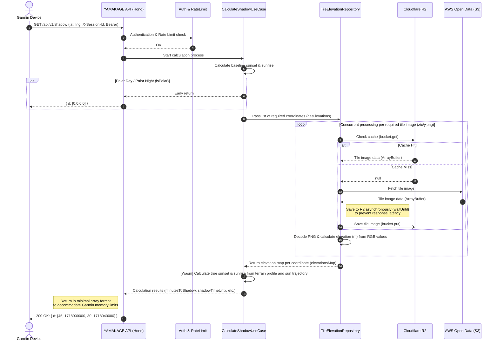
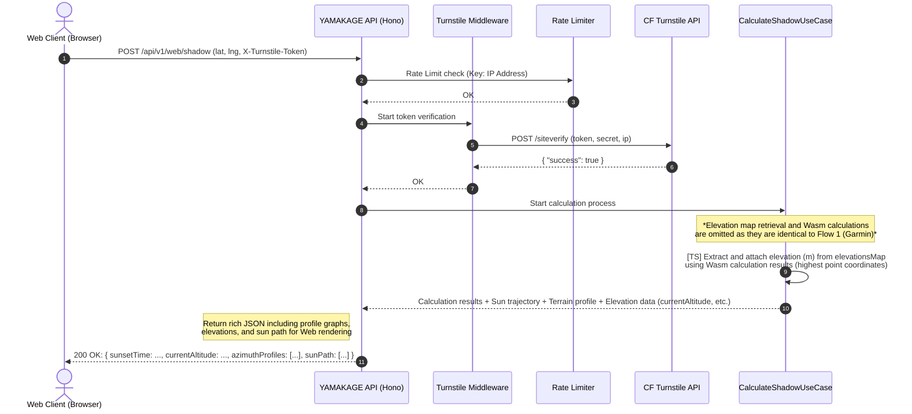

# Data Flow Diagrams

## 1. Core Feature (Garmin Version)

```mermaid
sequenceDiagram
    autonumber
    
    actor Garmin as Garmin Device
    participant API as YAMAKAGE API (Hono)
    participant Auth as Auth & RateLimit
    participant Usecase as CalculateShadowUseCase
    participant Repo as TileElevationRepository
    participant R2 as Cloudflare R2
    participant AWS as AWS Open Data (S3)

    Garmin->>API: GET /api/v1/shadow (lat, lng, X-Session-Id, Bearer)
    
    API->>Auth: Authentication & Rate Limit check
    Auth-->>API: OK
    
    API->>Usecase: Start calculation process
    
    Usecase->>Usecase: Calculate baseline sunset & sunrise
    alt Polar Day / Polar Night (isPolar)
        Usecase-->>API: Early return
        API-->>Garmin: { d: [0,0,0,0] }
    end
    
    Usecase->>Repo: Pass list of required coordinates (getElevations)
    
    loop Concurrent processing per required tile image (z/x/y.png)
        Repo->>R2: Check cache (bucket.get)
        alt Cache Hit
            R2-->>Repo: Tile image data (ArrayBuffer)
        else Cache Miss
            R2-->>Repo: null
            Repo->>AWS: Fetch tile image
            AWS-->>Repo: Tile image data (ArrayBuffer)
            
            note right of Repo: Save to R2 asynchronously (waitUntil)<br/>to prevent response latency
            Repo-)R2: Save tile image (bucket.put)
        end
        Repo->>Repo: Decode PNG & calculate elevation (m) from RGB values
    end
    
    Repo-->>Usecase: Return elevation map per coordinate (elevationsMap)
    
    Usecase->>Usecase: [Wasm] Calculate true sunset & sunrise from terrain profile and sun trajectory
    
    Usecase-->>API: Calculation results (minutesToShadow, shadowTimeUnix, etc.)
    
    note left of API: Return in minimal array format<br/>to accommodate Garmin memory limits
    API-->>Garmin: 200 OK: { d: [45, 1718000000, 30, 1718040000] }

```

---

## 2. Web Version

```mermaid
sequenceDiagram
    autonumber
    
    actor Web as Web Client (Browser)
    participant API as YAMAKAGE API (Hono)
    participant TurnstileMiddleware as Turnstile Middleware
    participant RateLimiter as Rate Limiter
    participant Cloudflare as CF Turnstile API
    participant Usecase as CalculateShadowUseCase

    Web->>API: POST /api/v1/web/shadow (lat, lng, X-Turnstile-Token)
    
    API->>RateLimiter: Rate Limit check (Key: IP Address)
    RateLimiter-->>API: OK
    
    API->>TurnstileMiddleware: Start token verification
    TurnstileMiddleware->>Cloudflare: POST /siteverify (token, secret, ip)
    Cloudflare-->>TurnstileMiddleware: { "success": true }
    TurnstileMiddleware-->>API: OK
    
    API->>Usecase: Start calculation process
    
    note over Usecase: *Elevation map retrieval and Wasm calculations<br/>are omitted as they are identical to Flow 1 (Garmin)*
    
    Usecase->>Usecase: [TS] Extract and attach elevation (m) from elevationsMap<br/>using Wasm calculation results (highest point coordinates)
    
    Usecase-->>API: Calculation results + Sun trajectory + Terrain profile + Elevation data (currentAltitude, etc.)
    
    note left of API: Return rich JSON including profile graphs,<br/>elevations, and sun path for Web rendering
    API-->>Web: 200 OK: { sunsetTime: ..., currentAltitude: ..., azimuthProfiles: [...], sunPath: [...] }

```