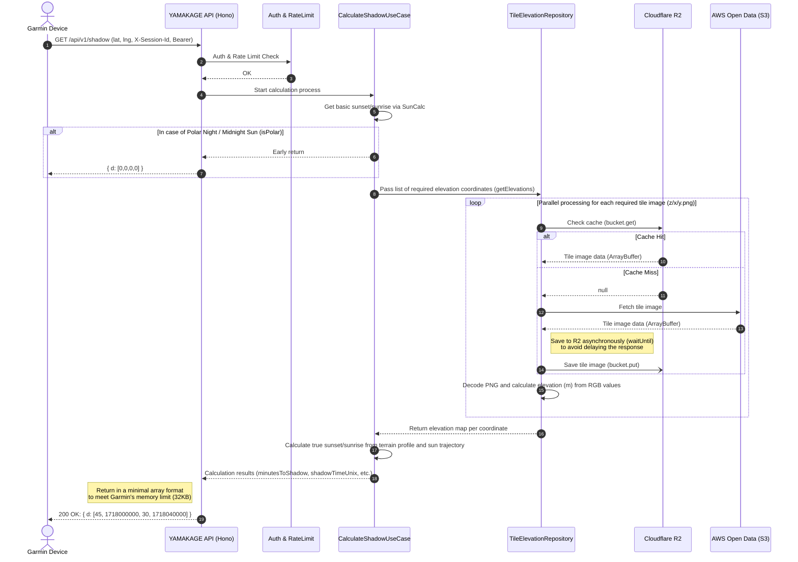
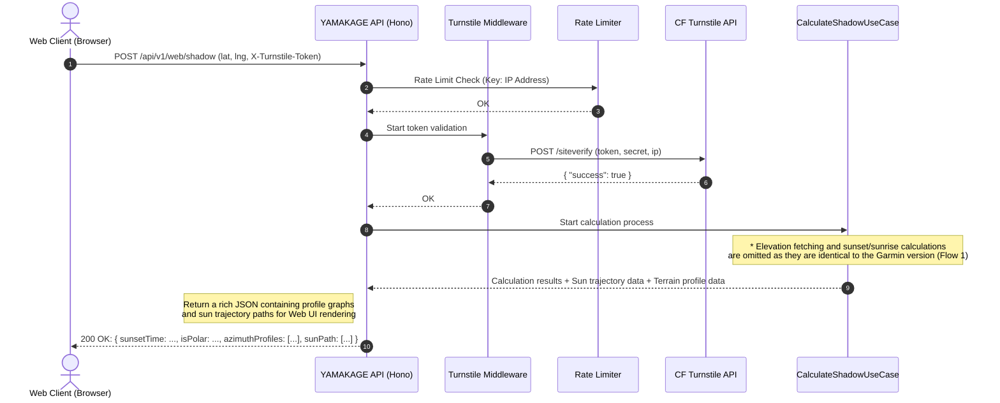

# Data Flow Diagram

## Core Functionality

```mermaid
sequenceDiagram
    autonumber
    
    actor Garmin as Garmin Device
    participant API as YAMAKAGE API (Hono)
    participant Auth as Auth & RateLimit
    participant Usecase as CalculateShadowUseCase
    participant Repo as TileElevationRepository
    participant R2 as Cloudflare R2
    participant AWS as AWS Open Data (S3)

    Garmin->>API: GET /api/v1/shadow (lat, lng, X-Session-Id, Bearer)
    
    API->>Auth: Auth & Rate Limit Check
    Auth-->>API: OK
    
    API->>Usecase: Start calculation process
    
    Usecase->>Usecase: Get basic sunset/sunrise via SunCalc
    alt In case of Polar Night / Midnight Sun (isPolar)
        Usecase-->>API: Early return
        API-->>Garmin: { d: [0,0,0,0] }
    end
    
    Usecase->>Repo: Pass list of required elevation coordinates (getElevations)
    
    loop Parallel processing for each required tile image (z/x/y.png)
        Repo->>R2: Check cache (bucket.get)
        alt Cache Hit
            R2-->>Repo: Tile image data (ArrayBuffer)
        else Cache Miss
            R2-->>Repo: null
            Repo->>AWS: Fetch tile image
            AWS-->>Repo: Tile image data (ArrayBuffer)
            
            note right of Repo: Save to R2 asynchronously (waitUntil)<br>to avoid delaying the response
            Repo-)R2: Save tile image (bucket.put)
        end
        Repo->>Repo: Decode PNG and calculate elevation (m) from RGB values
    end
    
    Repo-->>Usecase: Return elevation map per coordinate
    
    Usecase->>Usecase: Calculate true sunset/sunrise from terrain profile and sun trajectory
    
    Usecase-->>API: Calculation results (minutesToShadow, shadowTimeUnix, etc.)
    
    note left of API: Return in a minimal array format<br>to meet Garmin's memory limit (32KB)
    API-->>Garmin: 200 OK: { d: [45, 1718000000, 30, 1718040000] }

```

## Web Version

```mermaid
sequenceDiagram
    autonumber
    
    actor Web as Web Client (Browser)
    participant API as YAMAKAGE API (Hono)
    participant TurnstileMiddleware as Turnstile Middleware
    participant RateLimiter as Rate Limiter
    participant Cloudflare as CF Turnstile API
    participant Usecase as CalculateShadowUseCase

    Web->>API: POST /api/v1/web/shadow (lat, lng, X-Turnstile-Token)
    
    API->>RateLimiter: Rate Limit Check (Key: IP Address)
    RateLimiter-->>API: OK
    
    API->>TurnstileMiddleware: Start token validation
    TurnstileMiddleware->>Cloudflare: POST /siteverify (token, secret, ip)
    Cloudflare-->>TurnstileMiddleware: { "success": true }
    TurnstileMiddleware-->>API: OK
    
    API->>Usecase: Start calculation process
    
    note over Usecase: * Elevation fetching and sunset/sunrise calculations<br>are omitted as they are identical to the Garmin version (Flow 1)
    
    Usecase-->>API: Calculation results + Sun trajectory data + Terrain profile data
    
    note left of API: Return a rich JSON containing profile graphs<br>and sun trajectory paths for Web UI rendering
    API-->>Web: 200 OK: { sunsetTime: ..., isPolar: ..., azimuthProfiles: [...], sunPath: [...] }

```