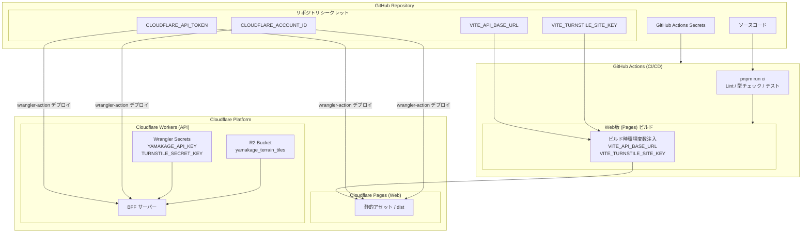

# YAMAKAGE CI/CD および環境変数管理仕様書

## 1. 概要

本プロジェクトでは、GitHub上のソースコード変更をトリガーに **GitHub Actions** が自動で品質チェック（Lint、型チェック、テスト）を行い、合格したコードのみを **Cloudflare（Pages / Workers）** へ安全にデプロイするCI/CDパイプラインを構築しています。

特にフロントエンド（Vite製 SPA）ではビルド時に環境変数を埋め込む必要があり、バックエンド（Cloudflare Workers）ではランタイム（実行時）にシークレットやR2バインドを安全に参照する仕組みをとっています。

---

## 2. 各種キー・環境変数の関係性

GitHubリポジトリに登録されたシークレットが、ビルドやデプロイのどの段階でどのように適用されるかを示した関係図です。

---

## 3. 環境変数とシークレットの詳細

### ① GitHub Actions Secrets（共通認証情報）

GitHubの「Settings > Secrets and variables > Actions」に登録する、インフラ操作用の機密情報です。

- **`CLOUDFLARE_API_TOKEN`**: Cloudflareへのデプロイ権限を持つAPIトークン。PagesおよびWorkersのデプロイアクション（`wrangler-action`）で使用します。
- **`CLOUDFLARE_ACCOUNT_ID`**: CloudflareのアカウントID。デプロイ先の特定に使用します。

### ② フロントエンド（Cloudflare Pages）用変数

Viteの仕様上、`VITE_` から始まる環境変数は**ビルド時（`pnpm run build`）にコード内へ静的に埋め込まれる**ため、GitHub Actionsのビルドステップに明示的に渡す必要があります。

- **`VITE_API_BASE_URL`**: フロントエンドから通信するバックエンドAPI（Workers）の本番URL。
- **`VITE_TURNSTILE_SITE_KEY`**: Cloudflare Turnstile（Bot保護）のクライアント側サイトキー。

> **設定場所:** GitHub Actions の Secrets に登録し、`deploy-pages.yml` の `env:` を介してビルドコマンドにインジェクションします。

### ③ バックエンド（Cloudflare Workers）用シークレット・バインディング

APIサーバー側は、Cloudflareのランタイム環境（Bindings / Secrets）として安全に管理されます。

- **`YAMAKAGE_API_KEY`**: Garminデバイス等からのリクエスト認証に用いるBearerトークン。
- **`TURNSTILE_SECRET_KEY`**: Webからのリクエストに対するTurnstileトークンのサーバー側検証キー。
- **`yamakage_terrain_tiles`**: 地形タイルをキャッシュするための Cloudflare R2 バケットバインディング。

> **設定場所:** ローカルでは `.dev.vars` で管理し、本番環境には Wrangler コマンド（`pnpm run register:apikey` 等）を用いて Cloudflare ダッシュボード側に直接暗号化保存（Secret登録）します。

---

## 4. デプロイメントフローの仕組み

1. **Push 検知**: `main` ブランチに対してコードがプッシュされると、変更されたパス（`web-site/**` または `backend/yamakage/**`）に応じて対応するワークフローが起動します。
2. **CI（品質保証）**: `pnpm install` の後、`pnpm run ci` が実行され、Biome（Lint・フォーマット）や TypeScript（型チェック）、Vitest（テスト）をパスすることを確認します。
3. **ビルド & デプロイ**:
- **Web版**: GitHub Secretsから環境変数を受け取ってビルドを行い、生成された `dist` を Wrangler を使って Cloudflare Pages へデプロイします。
- **API版**: テスト通過後、Wranglerを使って Cloudflare Workers へ直接デプロイします（ランタイムシークレットはCloudflare側で結合されます）。