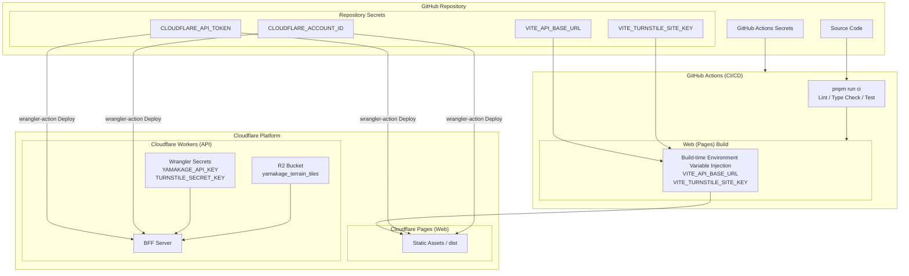

# YAMAKAGE CI/CD and Environment Variable Management Specification

## 1. Overview

In this project, we have built a CI/CD pipeline where **GitHub Actions** automatically performs quality checks (linting, type checking, tests) triggered by source code changes on GitHub, and safely deploys only the code that passes these checks to **Cloudflare (Pages / Workers)**.

Notably, the frontend (a Vite-based SPA) requires environment variables to be embedded at build time, while the backend (Cloudflare Workers) safely references secrets and R2 bindings at runtime.

---

## 2. Relationships Between Various Keys and Environment Variables

This diagram illustrates how secrets registered in the GitHub repository are applied at each stage of the build and deployment process.

---

## 3. Details of Environment Variables and Secrets

### ① GitHub Actions Secrets (Common Authentication Information)

Confidential information for infrastructure operations registered under GitHub's "Settings > Secrets and variables > Actions".

* **`CLOUDFLARE_API_TOKEN`**: API token with deployment permissions for Cloudflare. Used in the Pages and Workers deployment action (`wrangler-action`).
* **`CLOUDFLARE_ACCOUNT_ID`**: Cloudflare account ID. Used to specify the deployment target.

### ② Frontend (Cloudflare Pages) Variables

Due to Vite's specifications, environment variables starting with `VITE_` are **statically embedded into the code at build time (`pnpm run build`)**. Therefore, they must be explicitly passed to the GitHub Actions build step.

- **`VITE_API_BASE_URL`**: The production URL of the backend API (Workers) that the frontend communicates with.
- **`VITE_TURNSTILE_SITE_KEY`**: Client-side site key for Cloudflare Turnstile (bot protection).

> **Configuration Location:** Registered in GitHub Actions Secrets and injected into the build command via `env:` in `deploy-pages.yml`.

### ③ Backend (Cloudflare Workers) Secrets & Bindings

The API server side is securely managed as Cloudflare runtime environments (Bindings / Secrets).

- **`YAMAKAGE_API_KEY`**: Bearer token used to authenticate requests from Garmin devices and other clients.
- **`TURNSTILE_SECRET_KEY`**: Server-side verification key for Turnstile tokens against web requests.
- **`yamakage_terrain_tiles`**: Cloudflare R2 bucket binding used to cache terrain tiles.

> **Configuration Location:** Managed locally via `.dev.vars`, and directly encrypted and saved (as Secrets) to the Cloudflare dashboard in production using Wrangler commands (e.g., `pnpm run register:apikey`).

---

## 4. Deployment Flow Mechanics

1. **Push Detection**: When code is pushed to the `main` branch, the corresponding workflow is triggered depending on the modified paths (`web-site/**` or `backend/yamakage/**`).
2. **CI (Quality Assurance)**: After running `pnpm install`, `pnpm run ci` is executed to verify that Biome (linting/formatting), TypeScript (type checking), and Vitest (testing) all pass.
3. **Build & Deploy**:
- **Web Version**: Builds the app by receiving environment variables from GitHub Secrets, and deploys the generated `dist` to Cloudflare Pages using Wrangler.
- **API Version**: After tests pass, directly deploys to Cloudflare Workers using Wrangler (runtime secrets are bound on the Cloudflare side).