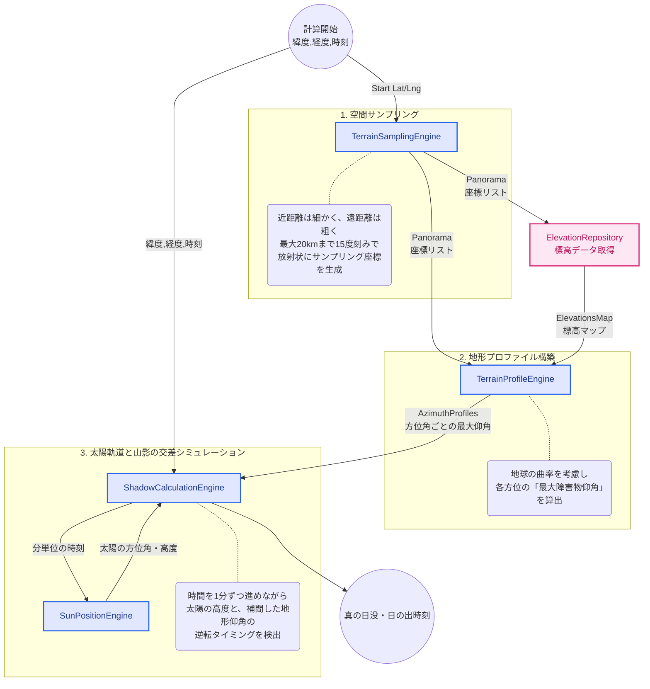

# ドメインアーキテクチャ図

### サンプリング間隔の最適化 (TerrainSamplingEngine)

計算量を抑えつつ近景の精度を上げるため、距離に応じてサンプリング間隔を動的に変更しています。

- 0〜500m: 100m間隔

- 500〜2km: 300m間隔

- 2km〜10km: 2000m間隔

- 10km〜20km: 5000m間隔

### 地球の曲率と大気差の考慮 (TerrainProfileEngine)

遠くの山ほど地球の丸みで沈んで見えるため、単純な標高差ではなく (距離^2 / 2R) * 0.86 （※0.86は大気差などを考慮した係数）を用いて、
見かけの標高低下を補正した上で仰角を計算しています。

### 分単位のシミュレーション (ShadowCalculationEngine)

数式で一発で交点を出すのは困難なため、指定時刻から最大48時間（2880分）先まで1分ずつ時間を進めるシミュレーションアプローチを採用しています。

各分ごとに SunPositionEngine (SunCalcのラッパー) で太陽位置を出し、地形プロファイル（15度刻み）を線形補間（getInterpolatedObstacleAngle）して、太陽高度が地形仰角を下回った（上回った）瞬間を答えとしています。