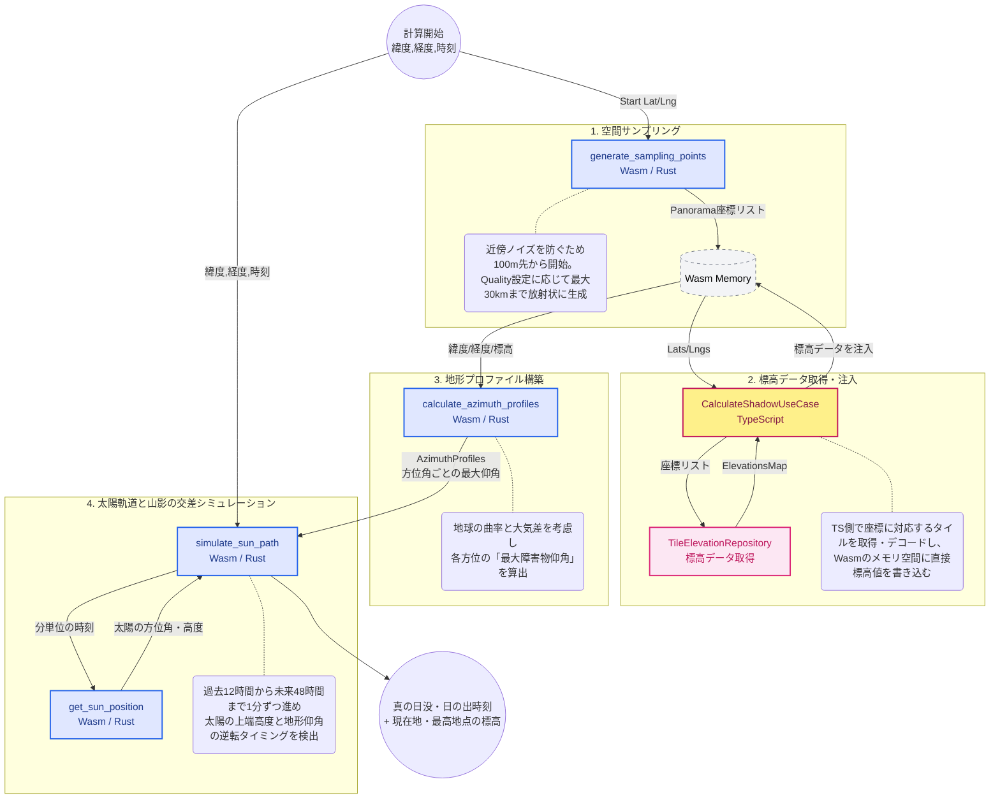

TypeScriptベースの計算ロジックがWebAssembly（Rust）に移植された現在のアーキテクチャに合わせて、ドメインアーキテクチャ図と説明文をアップデートしました。

計算負荷の高い空間サンプリングとシミュレーションを **Wasm（Rust）** に寄せ、I/Oが伴う標高データの取得を **TypeScript（Effect）** が担当してWasmのメモリ空間に直接データを注入する、ハイブリッドな構成を明確に表現しています。

---

# ドメインアーキテクチャ図

## 1. バックエンド計算アルゴリズム (TypeScript + WebAssembly)

### TypeScriptとWasmのメモリ共有アーキテクチャ

パフォーマンスのボトルネックとなる計算処理をRust(Wasm)化しつつ、非同期I/O通信が必要な標高タイルの取得をTypeScript側で担っています。TypeScript側で取得した大量の標高データをWasmのメモリ空間へ直接書き込むことで、シリアライズ/デシリアライズのオーバーヘッドをゼロに抑えています。

### サンプリング間隔の最適化

計算量を抑えつつ近景の精度を上げ、かつ足元のノイズを誤検知しないよう、距離に応じてサンプリング間隔を動的に変更しています（Quality2の場合）。

* 100〜2000m: 30m間隔
* 2.1km〜10km: 90m間隔
* 10.2km〜30km: 200m間隔

### 地球の曲率と大気差の考慮 (TerrainProfileEngine)

遠くの山ほど地球の丸みで沈んで見えるため、単純な標高差ではなく `(距離^2 / 2R) * 0.86` （※0.86は大気差などを考慮した係数）を用いて見かけの標高低下を補正しています。また、ユーザーの視界を正確にシミュレーションするため、現在地の標高に `1.5m`（目の高さ）を加算した上で仰角を計算しています。

### 分単位のシミュレーション (ShadowCalculationEngine)

数式で一発で交点を出すのは困難なため、指定時刻の **過去12時間前から未来48時間先（-720〜2880分）** まで1分ずつ時間を進めるシミュレーションアプローチを採用しています。各分ごとに太陽位置を計算し、地形プロファイル（方位角ごとの最大仰角）を線形補間して、太陽高度が地形仰角を下回った/上回った瞬間を日没/日の出としています。さらに太陽の視半径（約0.266度）を加味し、太陽の上端が隠れる/現れる瞬間を正確に判定します。
