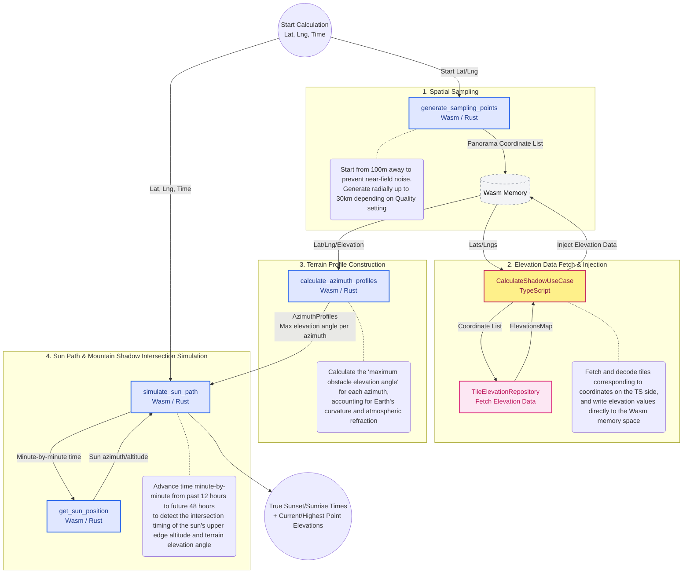

# Domain Architecture Diagram

## 1. Backend Calculation Algorithm (TypeScript + WebAssembly)

### TypeScript and Wasm Memory Sharing Architecture

While the performance-bottleneck computational processing has been migrated to Rust (Wasm), the TypeScript side is responsible for fetching elevation tiles, which requires asynchronous I/O communication. By writing the massive amount of elevation data fetched on the TypeScript side directly into the Wasm memory space, serialization/deserialization overhead is reduced to zero.

### Optimization of Sampling Intervals

To suppress computational load while increasing near-field accuracy and preventing false detection of immediate noise, the sampling interval is dynamically adjusted based on the distance (in the case of Quality 2).

* 100m - 2000m: 30m intervals
* 2.1km - 10km: 90m intervals
* 10.2km - 30km: 200m intervals

### Consideration of Earth's Curvature and Atmospheric Refraction (TerrainProfileEngine)

Since distant mountains appear to sink due to the Earth's curvature, the apparent drop in elevation is corrected using `(distance^2 / 2R) * 0.86` (*0.86 is the coefficient accounting for atmospheric refraction, etc.) instead of a simple elevation difference. Furthermore, to accurately simulate the user's field of view, the elevation angle is calculated after adding `1.5m` (eye level) to the current elevation.

### Minute-by-Minute Simulation (ShadowCalculationEngine)

Since it is difficult to analytically find the intersection point with a single equation, we adopted a simulation approach that advances time minute-by-minute from **12 hours in the past to 48 hours in the future (-720 to 2880 minutes)** from the specified time. For each minute, the sun's position is calculated, the terrain profile (maximum elevation angle for each azimuth) is linearly interpolated, and the exact moment the sun's altitude falls below or rises above the terrain elevation angle is determined as sunset or sunrise. Additionally, by accounting for the sun's angular radius (approx. 0.266 degrees), the exact moment the sun's upper edge hides or appears is accurately determined.