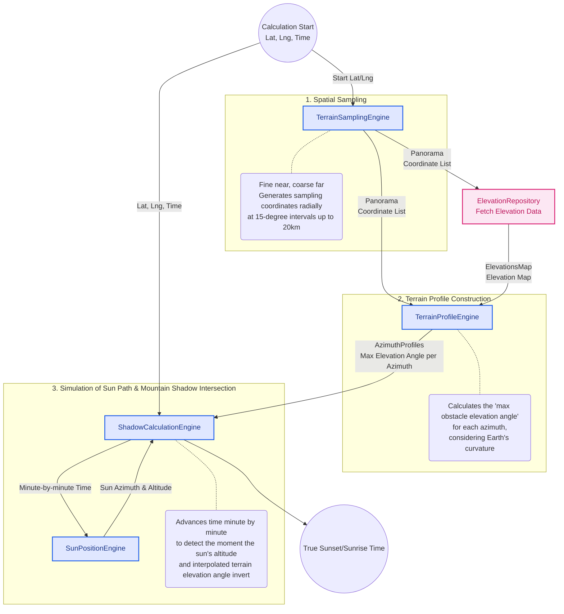

# Domain Architecture Diagram

### Optimization of Sampling Intervals (TerrainSamplingEngine)

To increase the accuracy of the near-field view while keeping computational costs low, the sampling intervals are dynamically adjusted based on distance.

- **0–500m:** 100m intervals
- **500m–2km:** 300m intervals
- **2km–10km:** 2,000m intervals
- **10km–20km:** 5,000m intervals

### Consideration of Earth's Curvature and Atmospheric Refraction (TerrainProfileEngine)

Because distant mountains appear lower due to the roundness of the Earth, the elevation angle is calculated after correcting for the apparent drop in elevation. Instead of using a simple elevation difference, we use the formula `(Distance^2 / 2R) * 0.86` (where 0.86 is a coefficient accounting for atmospheric refraction, etc.) to apply this correction.

### Minute-by-Minute Simulation (ShadowCalculationEngine)

Since it is difficult to calculate the exact intersection point using a single mathematical formula, we adopted a simulation approach that advances the time minute by minute, up to 48 hours (2,880 minutes) ahead of the specified time.

For each minute, the solar position is calculated using the `SunPositionEngine` (a SunCalc wrapper). The terrain profile (sampled at 15-degree intervals) is then linearly interpolated (`getInterpolatedObstacleAngle`), and the exact moment the sun's altitude drops below (or rises above) the terrain's elevation angle is identified as the result.