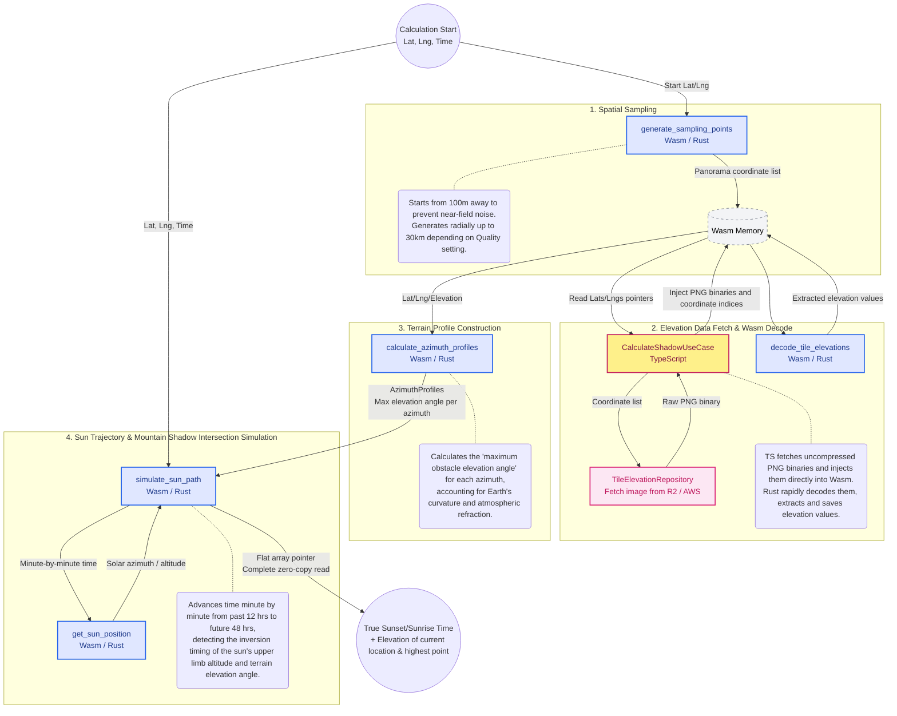

# Domain Architecture Diagram

## 1. Backend Calculation Algorithm (TypeScript + WebAssembly)

### TypeScript and Wasm Architecture

While computational processes that act as performance bottlenecks are handled by Rust (Wasm), fetching elevation tiles that require asynchronous I/O communication is handled on the TypeScript side.
The most significant feature is the complete zero-copy design, which entirely avoids heavy image extraction and JSON serialization on the JS side. By pouring uncompressed PNG binaries fetched on the TS side directly into the Wasm memory space and letting Rust handle the image decoding and elevation extraction, memory bloat (GC spikes) on the JS side is completely eliminated. Furthermore, reading the output results via a pointer to a flat 1D array achieves faster response times and conserves container resources.

### Sampling Interval Optimization

To reduce computational load while increasing near-field accuracy and preventing false detection of noise right at the user's feet, the sampling interval is dynamically changed based on the distance (for Quality 2 settings).

- 100 to 2000m: 30m intervals
- 2.1km to 10km: 90m intervals
- 10.2km to 30km: 200m intervals

### Consideration of Earth's Curvature and Atmospheric Refraction (TerrainProfileEngine)

Because distant mountains appear to sink below the horizon due to the roundness of the Earth, the apparent drop in elevation is corrected using `(Distance^2 / 2R) * 0.86` (where 0.86 is a coefficient accounting for atmospheric refraction, etc.) rather than simple elevation differences. Additionally, to accurately simulate the user's field of view, `1.5m` (eye level) is added to the elevation of the current location before calculating the elevation angle.

### Minute-by-Minute Simulation (ShadowCalculationEngine)

Because it is difficult to find the exact intersection point in a single mathematical formula, a simulation approach is adopted that advances time minute by minute from **12 hours in the past to 48 hours in the future (-720 to 2880 minutes)** relative to the specified time. The solar position is calculated for each minute, the terrain profile (maximum elevation angle per azimuth) is linearly interpolated, and the exact moment the sun's altitude drops below or rises above the terrain elevation angle is determined as sunset or sunrise. Furthermore, by factoring in the sun's apparent angular radius (approximately 0.266 degrees), the exact moment the upper limb of the sun hides or emerges is accurately detected.