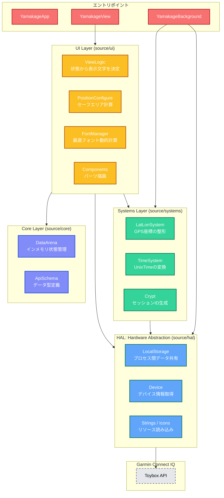
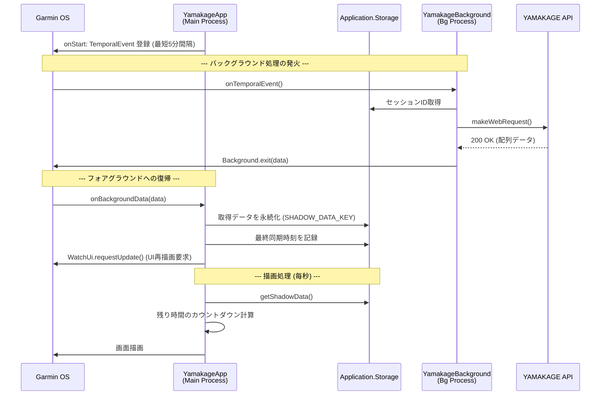
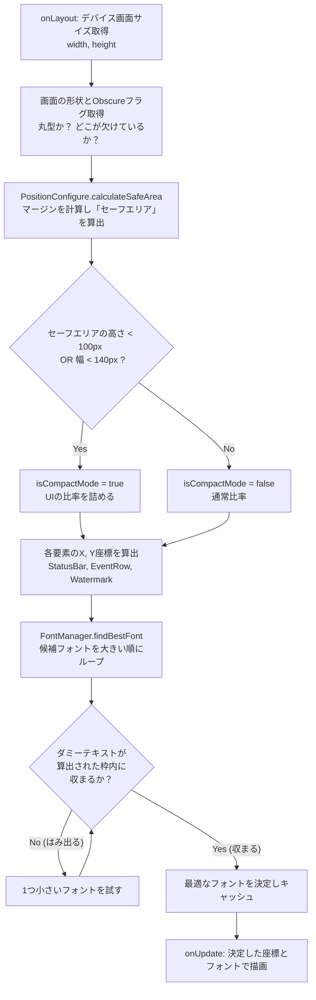

# Garmin App Architecture (YAMAKAGE)

本ドキュメントは、Garmin Connect IQ アプリである「YAMAKAGE」の内部アーキテクチャ、モジュール構成、およびUIのレスポンシブ描画ロジックについて定義します。

## 1. モジュール構成と依存関係

Garminの `Toybox` APIへの直接的な依存を避け、テスト容易性と保守性を高めるため、レイヤードアーキテクチャを採用しています。

### 設計思想

- **HAL (Hardware Abstraction Layer)**: Garmin標準の `Toybox` APIを直接UI層から呼ばず、HALでラップしています。これにより、OSのバージョン差異の吸収や、Mockを用いた単体テスト（シミュレータなしでのテスト）を容易にしています。
- **DataArena (Core)**: UIの描画座標や文字列など、ステートフルな情報をシングルトン的に管理する場所として `DataArena` を定義し、計算ロジックと描画ロジックを分離しています。本来は状態を変更できるクロージャを提供するような設計(React的な設計)にする方が安全ですが、関数呼び出しのオーバーヘッドをなくすため直接変更を許容しています。

---

## 2. プロセス間データフロー (Foreground / Background)

GarminのDataFieldアプリにおいて、外部通信（HTTP）はバックグラウンドプロセス（Temporal Event）でしか実行できません。
バックグラウンドで取得したAPIデータを、どのようにメインアプリ（フォアグラウンド）のUIへ渡しているかを示します。

### 設計のポイント

* バックグラウンドプロセスからメインプロセスへのデータの受け渡しは、`Background.exit()` の引数として渡し、`onBackgroundData()` で受け取った後に `Application.Storage` に書き込む設計としています。
* 通信エラー時も `error` オブジェクトを渡し、Storageに記録することで、メインUIが「通信中」「更新失敗」などの状態を正しく表示できるようにしています。

---

## 3. UIレスポンシブ計算ロジック

Garminデバイスは、円形・矩形・一部が隠れるなど画面形状が多様です。YAMAKAGEでは、XMLによる固定レイアウトを使用せず、**コードベースで動的にセーフエリアとフォントを計算するロジック**を採用しています。

### 動的計算を採用した理由

- XMLレイアウト（`layout.xml`）を用いた場合、数百あるGarminデバイスごとに微調整したレイアウト定義を用意する必要があり、メンテナンス性が悪いです。
- この動的アプローチにより、画面サイズから使用可能な最大の領域を計算し、文字がはみ出さない最大のフォントを自動で選定するため、**新機種が発売されてもコードの変更なしで自動的に最適なレイアウトが適用される**設計になっています。
