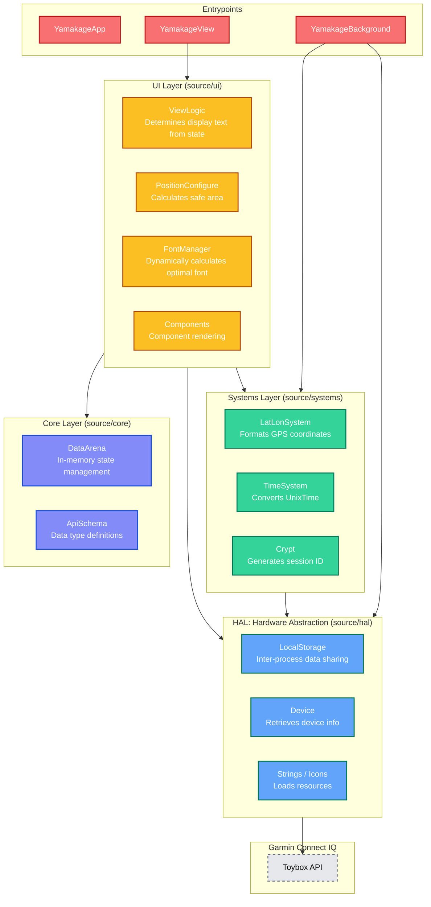
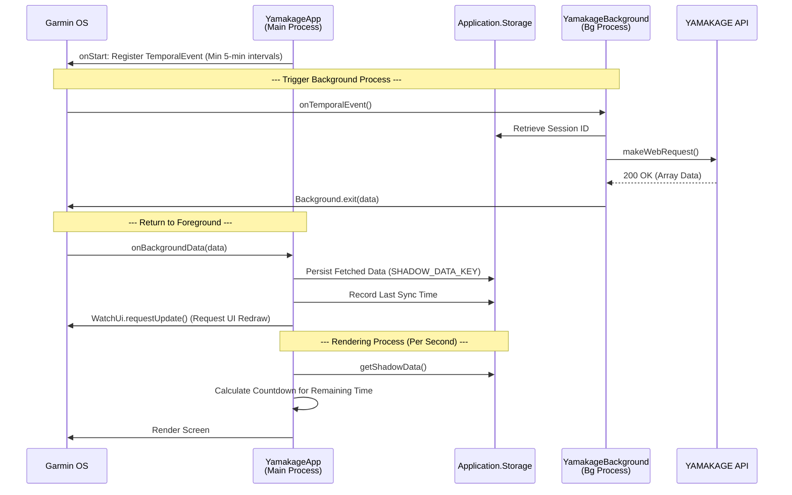
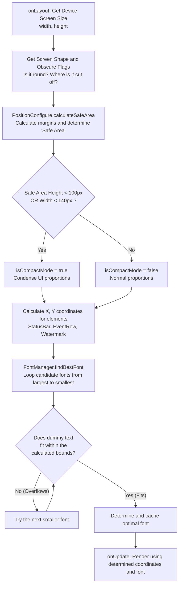

# Garmin App Architecture (YAMAKAGE)

This document defines the internal architecture, module structure, and responsive UI rendering logic of the Garmin Connect IQ app "YAMAKAGE".

## 1. Module Structure and Dependencies

To avoid direct dependency on Garmin's `Toybox` API and to enhance testability and maintainability, a layered architecture is adopted.

### Design Philosophy

- **HAL (Hardware Abstraction Layer)**: Wraps the standard Garmin `Toybox` API instead of calling it directly from the UI layer. This absorbs OS version differences and facilitates unit testing using mocks (testing without a simulator).
- **DataArena (Core)**: Defines `DataArena` as a singleton-like store for stateful information, such as UI rendering coordinates and strings, separating calculation logic from rendering logic. While a design providing state-mutating closures (like React) is typically safer, direct modifications are permitted to eliminate function call overhead.

---

## 2. Inter-Process Data Flow (Foreground / Background)

In Garmin Data Field apps, external communication (HTTP) can only be executed in a background process (Temporal Event). This section illustrates how API data fetched in the background is passed to the main app's (foreground) UI.

### Design Highlights

- Data is passed from the background process to the main process by supplying it as an argument to `Background.exit()`, receiving it in `onBackgroundData()`, and then writing it to `Application.Storage`.
- Even during communication errors, an `error` object is passed and recorded in Storage. This ensures the main UI correctly displays states like "Communicating" or "Update Failed".

---

## 3. Responsive UI Calculation Logic

Garmin devices come in various screen shapes, including circular, rectangular, and partially obscured. Instead of using fixed XML layouts, YAMAKAGE adopts a **code-based logic that dynamically calculates safe areas and fonts**.

### Reasons for Adopting Dynamic Calculations

* Using XML layouts (`layout.xml`) would require maintaining finely-tuned layout definitions for hundreds of different Garmin devices, resulting in poor maintainability.
* With this dynamic approach, the app calculates the maximum usable area based on the screen size and automatically selects the largest font that doesn't overflow. This design ensures that **the optimal layout is automatically applied even when new device models are released, without requiring code changes**.