# YAMAKAGE Watch App アーキテクチャ

## 1. 概要
本ドキュメントは、Garmin向け「YAMAKAGE」の`Watch App`版(DeviceApp)におけるアプリケーションアーキテクチャを定義しています。
`Data Field`版とは異なり、全画面を占有し、複数の画面（ビュー）をユーザー操作によって遷移する独立したアプリケーションとして動作します。
状態管理とルーティングには内製フレームワーク「**MonkeyHooks**」を採用し、UIコンポーネントとビジネスロジックの厳密な分離を行っています。

## 2. 全体的な設計思想
1. **フィーチャーベースのモジュール分割 (Feature-based Architecture)**
   各画面や機能（Main, Details, Panorama, Radar, SkyPlot 等）ごとにディレクトリを分割し、その機能内で完結するコンポーネントとロジックをカプセル化しています。
2. **View / Render / Logic の分離**
   - **View**: OSのライフサイクル管理、状態の購読、プロパティの組み立てに専念する。
   - **Render / Components**: `View`から渡されたデータ（Props）に基づいて描画のみを行う純粋関数として実装しています。
   - **Logic**: 計算、文字列フォーマットなどのドメインロジックを担当しています。
3. **Props配列によるデータ受け渡し**
   `View`から`Render`へ渡すデータは、オーバーヘッドを最小化するため、Enumでインデックス定義された固定長の`Array`（Props配列）を使用します。

### アーキテクチャ

```mermaid
flowchart TB
    subgraph AppLayer ["1. App Layer (アプリケーション層)"]
        App["YamakageWatchApp\n(アプリのエントリポイント・初期化)"]
    end

    subgraph CoreLayer ["2. Core Layer (状態管理・ルーティング層)"]
        AppArena["AppArena / CustomContext\n(MonkeyHooksを利用したグローバル状態管理)"]
        Config["ApiSchema / Config / Consts\n(定数・API型定義・設定)"]
    end

    subgraph FeaturesLayer ["3. Features Layer (プレゼンテーション・各画面)"]
        Main["Main\n(起動画面・ターゲット選択・API通信開始)"]
        Panorama["Panorama\n(横視点の山容シルエット・軌道表示)"]
        Radar["Radar\n(上空から見下ろすレーダー視点表示)"]
        SkyPlot["SkyPlot\n(天球プロット視点表示)"]
        Details["Details\n(日の出/日の入り時刻・詳細テキスト)"]
        Misc["Loading / Error / Settings\n(各種ユーティリティ画面)"]
    end

    subgraph FeatureInternal ["各機能の内部構成"]
        direction LR
        View["View\n(ライフサイクル・状態購読)"]
        Delegate["Delegate\n(キー/タッチ操作・画面遷移)"]
        Render["Render / Components\n(UIコンポーネント・描画)"]
        Logic["Logic\n(画面固有のビジネスロジック)"]
        
        View --> Render
        View --> Logic
    end

    subgraph SharedLayer ["4. Shared & Systems Layer (共通ドメイン層)"]
        SharedUI["Shared::Ui\n(共通UI部品: アイコン, ボタン, トグル等)"]
        SharedLogic["Shared::Logic\n(フォント動的計算, 背景アニメーション)"]
        Systems["Systems\n(セッションID生成, 時刻フォーマット)"]
    end

    subgraph InfraLayer ["5. Infrastructure Layer (インフラストラクチャ層)"]
        direction LR
        ApiClient["Network::ApiClient\n(太陽・月シャドウデータ取得API)"]
        HAL["Hal::Sensor / DateTime\n(GPS, コンパス, デバイス時刻の抽象化)"]
    end

    ExtAPI((External API\nSun/Moon Data))
    Hardware((Device Hardware\nGPS / Compass))

    App --> |ルーティング初期化| CoreLayer
    App --> |初期画面| FeaturesLayer
    
    FeaturesLayer -.-> FeatureInternal

    FeaturesLayer --> |State Read/Write| AppArena
    FeaturesLayer --> |共通部品の利用| SharedLayer
    FeaturesLayer --> |センサーアクセス| HAL

    Main --> |APIリクエスト| ApiClient
    ApiClient --> |HTTP通信| ExtAPI
    
    HAL --> |ハードウェアアクセス| Hardware

    classDef layer fill:#2f4f4f,stroke:#333,stroke-width:2px;
    class AppLayer,CoreLayer,FeaturesLayer,SharedLayer,InfraLayer layer;
```


## 3. ディレクトリ・モジュール構成
```text
source/
  ├── YamakageWatchApp.mc      # アプリケーション・エントリーポイント
  ├── core/                    # MonkeyHooks用のStore定義 (CoreArena, DetailsUiArenaなど)
  ├── features/                # 画面・機能ごとのモジュール群
  │     ├── main/
  │     ├── details/
  │     ├── panorama/
  │     ├── radar/
  │     ├── skyplot/
  │     ├── settings/
  │     ├── loading/
  │     └── error/
  ├── shared/                  # アプリ全体で共有するリソース
  │     ├── ui/                # 汎用UIコンポーネント (Button, Toggle, Icons等)
  │     └── logic/             # 汎用ロジック (FontManager, BackgroundAnimation等)
  ├── systems/                 # OSや通信機能へのアクセス (ApiClient, Crypt, TimeSystem)
  └── hal/                     # ハードウェア抽象化層 (CompassSensor等)

```

## 4. クラスの役割とデータフロー

### 4.1 画面ごとの構造

各フィーチャー（例：`Details`）は基本的に以下のファイル群で構成されます。

* **`DetailsView.mc`**
`WatchUi.View`を継承。`onLayout`でフォントや画面サイズをキャッシュし、`onShow`で`MonkeyHooks`のStoreからデータを購読・取得します。`onUpdate`時に最新のコンパスの向きなどを取得し、Props配列を更新して`DetailsRender`へ渡します。
* **`DetailsDelegate.mc`**
`WatchUi.BehaviorDelegate`を継承。ボタン入力、スワイプ、タップなどのユーザーインタラクションを受け取り、ルーティング処理を発火させます。
* **`DetailsRender.mc`**
描画のエントリーポイント。画面のクリアやページインジケーターの描画などの全体調整を行い、具体的なUIパーツへと処理を委譲します。
* **`components/`**
画面を構成する個別のUIパーツ（`DetailsRow`, `DetailsMoonRow`など）。状態を持たず、引数として受け取ったデータのみを用いて描画(`dc.drawText`, `dc.fillPolygon`)を行います。
* **`DetailsLogic.mc`**
データの計算、フォーマット変換、配列操作などの純粋なロジック処理を行います。

### 4.2 状態管理とルーティング (MonkeyHooks)

* **Store (Arena)**: `coreA.DISPLAY_WIDTH` や `SettingIds.ANIM_ENABLED` などのグローバルな状態や設定値を管理する。
* **データ購読**: `View`の`onShow`内で`MH.watch()`を使用し、エラー情報などの特定の状態が更新された際に自動でコールバック（例:`onErrorChanged`）が発火する仕組みを利用します。
* **ルーティング**: `YamakageWatchApp`にて`MH.Router.initialize(method(:_viewFactory))`を行い、各`Delegate`からは `MH.Router.switchTo()` や `MH.Router.pop()` を用いて画面遷移を行います。

## 5. ネットワーク通信と永続化

* **ApiClient (`Communications.makeWebRequest`)**
バックエンド（Cloudflare Workers / WASM）に対して現在地情報を送信し、計算済みの太陽・月の軌道・標高プロファイルデータを受信します。
* **Session Management (`Crypt.mc`)**
バックエンド側での流量制限（レートリミット）制御のため、アプリの初回起動時にのみ`generateRandomSessionId()`でセッションIDを生成し、OSのストレージ(`Application.Storage`)に永続化する。通信時はこのIDをHTTPヘッダーに付与します。

## 6. テスト戦略

各フィーチャー、および共有機能ごとに以下のテストを実装し、継続的に品質を担保する。

* **LogicTests**: ロジックモジュールの純粋な計算結果・文字列フォーマットの検証をテストします。
* **SmokeTests**: 異常な状態や境界値データが渡された際でも、レンダリング関数（`render`）がクラッシュ（`Unexpected Type Error`など）しないことを検証します。
* **IntegrationTests**: Viewのライフサイクル(`initialize` -> `onLayout` -> `onShow` -> `onUpdate` -> `onHide`)が正常に回ること、各種TargetMode(Sun/Moon)で描画が完遂することを検証します。
* **BenchmarkTests**: 描画関数の実行速度（ms/frame）を測定し、規定の閾値内に収まっているか（深刻なパフォーマンスのデグレードがないか）を検証。実機での実行速度とは異なるため、あくまでリファクタリング時などの実行速度変化などを検出するために実装しています。

```