# YAMAKAGE Watch App Architecture

## 1. Overview

This document defines the application architecture for the `Watch App` (DeviceApp) version of "YAMAKAGE" for Garmin.
Unlike the `Data Field` version, it operates as an independent application that occupies the entire screen and transitions between multiple screens (views) based on user interactions.
It adopts an in-house framework "**MonkeyHooks**" for state management and routing, ensuring strict separation between UI components and business logic.

## 2. Overall Design Philosophy

1. **Feature-based Architecture**
Directories are divided by screens or features (e.g., Main, Details, Panorama, Radar, SkyPlot), encapsulating the components and logic that complete within that specific feature.
2. **Separation of View / Render / Logic**
* **View**: Focuses solely on OS lifecycle management, state subscription, and assembling properties.
* **Render / Components**: Implemented as pure functions that only perform drawing based on the data (Props) passed from the `View`.
* **Logic**: Handles domain logic such as calculations and string formatting.


3. **Data Passing via Props Arrays**
To minimize overhead, data passed from the `View` to `Render` uses fixed-length `Array`s (Props arrays) index-defined by Enums.

### Architecture

```mermaid
flowchart TB
    subgraph AppLayer ["1. App Layer"]
        App["YamakageWatchApp\n(App Entry Point & Initialization)"]
    end

    subgraph CoreLayer ["2. Core Layer (State Management & Routing)"]
        AppArena["AppArena / CustomContext\n(Global state management using MonkeyHooks)"]
        Config["ApiSchema / Config / Consts\n(Constants, API type definitions, Settings)"]
    end

    subgraph FeaturesLayer ["3. Features Layer (Presentation & Screens)"]
        Main["Main\n(Startup screen, Target selection, API trigger)"]
        Panorama["Panorama\n(Lateral mountain silhouette & trajectory view)"]
        Radar["Radar\n(Top-down radar perspective view)"]
        SkyPlot["SkyPlot\n(Celestial sphere plot view)"]
        Details["Details\n(Sunrise/Sunset times & detailed text)"]
        Misc["Loading / Error / Settings\n(Various utility screens)"]
    end

    subgraph FeatureInternal ["Internal Structure of Each Feature"]
        direction LR
        View["View\n(Lifecycle & State Subscription)"]
        Delegate["Delegate\n(Key/Touch input & Screen transition)"]
        Render["Render / Components\n(UI Components & Drawing)"]
        Logic["Logic\n(Screen-specific business logic)"]
        
        View --> Render
        View --> Logic
    end

    subgraph SharedLayer ["4. Shared & Systems Layer (Common Domain)"]
        SharedUI["Shared::Ui\n(Common UI parts: Icons, Buttons, Toggles, etc.)"]
        SharedLogic["Shared::Logic\n(Dynamic font calculation, Background animation)"]
        Systems["Systems\n(Session ID generation, Time formatting)"]
    end

    subgraph InfraLayer ["5. Infrastructure Layer"]
        direction LR
        ApiClient["Network::ApiClient\n(Fetch Sun/Moon shadow data API)"]
        HAL["Hal::Sensor / DateTime\n(Abstraction of GPS, Compass, Device time)"]
    end

    ExtAPI((External API\nSun/Moon Data))
    Hardware((Device Hardware\nGPS / Compass))

    App --> |Routing Initialization| CoreLayer
    App --> |Initial Screen| FeaturesLayer
    
    FeaturesLayer -.-> FeatureInternal

    FeaturesLayer --> |State Read/Write| AppArena
    FeaturesLayer --> |Uses Common Parts| SharedLayer
    FeaturesLayer --> |Sensor Access| HAL

    Main --> |API Request| ApiClient
    ApiClient --> |HTTP Communication| ExtAPI
    
    HAL --> |Hardware Access| Hardware

    classDef layer fill:#2f4f4f,stroke:#333,stroke-width:2px;
    class AppLayer,CoreLayer,FeaturesLayer,SharedLayer,InfraLayer layer;

```



## 3. Directory & Module Structure

```text
source/
  ├── YamakageWatchApp.mc      # Application Entry Point
  ├── core/                    # Store definitions for MonkeyHooks (CoreArena, DetailsUiArena, etc.)
  ├── features/                # Modules grouped by screen/feature
  │     ├── main/
  │     ├── details/
  │     ├── panorama/
  │     ├── radar/
  │     ├── skyplot/
  │     ├── settings/
  │     ├── loading/
  │     └── error/
  ├── shared/                  # Resources shared across the entire app
  │     ├── ui/                # General-purpose UI components (Button, Toggle, Icons, etc.)
  │     └── logic/             # General-purpose logic (FontManager, BackgroundAnimation, etc.)
  ├── systems/                 # Access to OS and network functions (ApiClient, Crypt, TimeSystem)
  └── hal/                     # Hardware Abstraction Layer (CompassSensor, etc.)

```

## 4. Class Roles & Data Flow

### 4.1 Structure per Screen

Each feature (e.g., `Details`) generally consists of the following files:

* **`DetailsView.mc`**
Inherits `WatchUi.View`. Caches fonts and screen sizes in `onLayout`, and subscribes to/fetches data from the `MonkeyHooks` Store in `onShow`. During `onUpdate`, it retrieves the latest compass heading, updates the Props array, and passes it to `DetailsRender`.
* **`DetailsDelegate.mc`**
Inherits `WatchUi.BehaviorDelegate`. Handles user interactions like button presses, swipes, and taps, triggering routing processes.
* **`DetailsRender.mc`**
The entry point for drawing. Handles overall adjustments like clearing the screen and drawing page indicators, then delegates processing to specific UI parts.
* **`components/`**
Individual UI parts comprising the screen (e.g., `DetailsRow`, `DetailsMoonRow`). They are stateless and perform drawing (`dc.drawText`, `dc.fillPolygon`) using only the data passed as arguments.
* **`DetailsLogic.mc`**
Performs pure logic processing such as data calculations, format conversions, and array manipulations.

### 4.2 State Management and Routing (MonkeyHooks)

* **Store (Arena)**: Manages global states and settings such as `coreA.DISPLAY_WIDTH` and `SettingIds.ANIM_ENABLED`.
* **State Subscription**: Utilizes `MH.watch()` within the `View`'s `onShow` to automatically trigger callbacks (e.g., `onErrorChanged`) when specific states, like error information, are updated.
* **Routing**: Initializes routing via `MH.Router.initialize(method(:_viewFactory))` in `YamakageWatchApp`, and uses `MH.Router.switchTo()` or `MH.Router.pop()` from each `Delegate` to transition between screens.

## 5. Network Communication & Persistence

* **ApiClient (`Communications.makeWebRequest`)**
Sends current location data to the backend (Cloudflare Workers / WASM) and receives pre-calculated solar/lunar trajectories and elevation profile data.
* **Session Management (`Crypt.mc`)**
To control backend traffic (rate limiting), a session ID is generated using `generateRandomSessionId()` only upon the app's first launch and persisted in the OS storage (`Application.Storage`). This ID is attached to the HTTP headers during communication.

## 6. Testing Strategy

To continuously ensure quality, the following tests are implemented for each feature and shared module:

* **LogicTests**: Verifies the pure calculation results and string formatting of the logic modules.
* **SmokeTests**: Verifies that rendering functions (`render`) do not crash (e.g., `Unexpected Type Error`) even when abnormal states or boundary value data are passed.
* **IntegrationTests**: Verifies that the View's lifecycle (`initialize` -> `onLayout` -> `onShow` -> `onUpdate` -> `onHide`) runs normally, and that rendering completes successfully under various TargetModes (Sun/Moon).
* **BenchmarkTests**: Measures the execution speed (ms/frame) of rendering functions to verify if they fall within prescribed thresholds (checking for severe performance degradation). Since these differ from execution speeds on actual devices, they are implemented primarily to detect execution speed changes during refactoring.