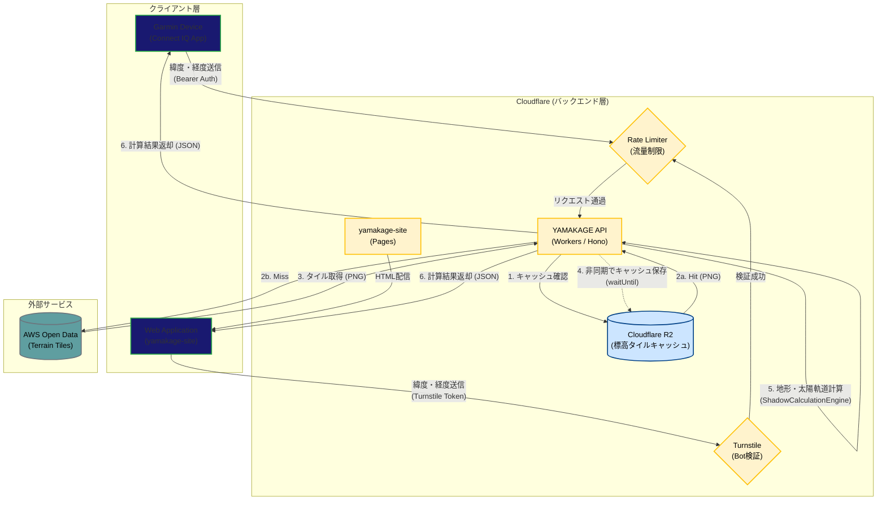

# システム構成図

本ドキュメントは、YAMAKAGEアプリおよびバックエンドAPI（BFF）の全体的なシステム構成と、データフローの概要を定義します。

## システム全体図

以下の図は、クライアント（Garminデバイス / Web）からバックエンド、そして外部サービス（AWS Open Data）に至るまでのシステム全体の繋がりを示しています。

## コンポーネント詳細

### 1. クライアント層

### **Garmin Device (`yamakage/source/`)**
- Monkey C で実装された Connect IQ データフィールドアプリです。
- GPSから取得した緯度・経度をバックグラウンド処理（最短5分間隔）でAPIへ送信します。
- API認証には `YAMAKAGE_API_KEY` を用いた Bearer トークン認証を使用します。

### **Web Application (`yamakage-site`)**
- Webブラウザ向けに機能を提供するクライアントです。
- `Cloudflare Pages`より静的ファイルを配信しています。
- 不正アクセスやBotリクエストを防ぐため、リクエスト時に `Cloudflare Turnstile` のトークンを付与します。

### 2. バックエンド層 (Cloudflare Workers)

### **YAMAKAGE API (`yamakage/backend/yamakage/`)**
- `Cloudflare Workers ＋ Hono` で構築された`BFF（Baskends For Frontends）`です。
- クライアントから送られた位置情報を元に、必要な標高タイルを収集し、太陽の軌道（`suncalcライブラリ`）と地形の断面図（`TerrainProfileEngine`）を掛け合わせて日没・日の出時刻をインメモリで計算します。
- Garminデバイスの処理能力とバッテリーを温存するため、重い計算処理をすべてここで行っています。

### **Rate Limiter / Turnstile**
- APIの過負荷やDDoS攻撃を防ぐため、セッションIDやIPアドレス単位でリクエスト数を制限（Rate Limit）しています。Webクライアントからのアクセスには`Turnstile`によるBot検証を挟みます。

### **Cloudflare R2**
- AWSから取得した標高タイル画像（PNG）をキャッシュするオブジェクトストレージです。
- 外部APIへのリクエスト数を減らし、レスポンス速度を向上させます。

### 3. 外部サービス

- **AWS Open Data ([s3.amazonaws.com/elevation-tiles-prod/](https://s3.amazonaws.com/elevation-tiles-prod/))**
- パブリックに提供されている世界中の地形標高データ（Terrarium形式のPNGタイル）。
- キャッシュ（R2）に存在しないエリアがリクエストされた場合のみ、ここへフェッチしに行きます。