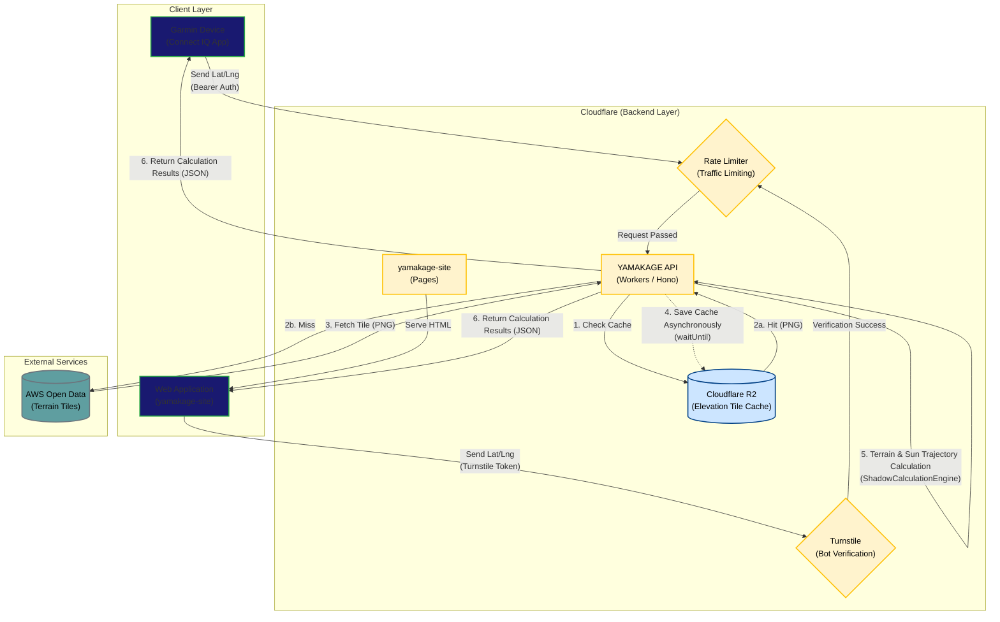

# System Architecture Diagram

This document defines the overall system architecture and provides an overview of the data flow for the YAMAKAGE app and the backend API (BFF).

## Overall System Diagram

The following diagram illustrates the overall system connections from the clients (Garmin devices / Web) to the backend and external services (AWS Open Data).

## Component Details

### 1. Client Layer

### **Garmin Device (`yamakage/source/`)**

- A Connect IQ data field app implemented in Monkey C.
- Sends the latitude and longitude acquired from the GPS to the API via background processing (at minimum 5-minute intervals).
- Uses Bearer token authentication with `YAMAKAGE_API_KEY` for API authentication.

### **Web Application (`yamakage-site`)**

- A client that provides features for web browsers.
- Serves static files via `Cloudflare Pages`.
- Attaches a `Cloudflare Turnstile` token to requests to prevent unauthorized access and Bot requests.

### 2. Backend Layer (Cloudflare Workers)

### **YAMAKAGE API (`yamakage/backend/yamakage/`)**

- A `BFF (Backend For Frontend)` built with `Cloudflare Workers + Hono`.
- Based on the location data sent from the client, it collects the necessary elevation tiles, combines the sun's trajectory (`suncalc` library) with the terrain profile (`TerrainProfileEngine`), and calculates the sunset and sunrise times in-memory.
- Performs all heavy calculations here to preserve the processing power and battery life of the Garmin device.

### **Rate Limiter / Turnstile**

- Limits the number of requests (Rate Limit) per session ID or IP address to prevent API overload and DDoS attacks. Access from web clients goes through Bot verification via `Turnstile`.

### **Cloudflare R2**

- Object storage that caches elevation tile images (PNG) fetched from AWS.
- Reduces the number of requests to external APIs and improves response speed.

### 3. External Services

- **AWS Open Data ([s3.amazonaws.com/elevation-tiles-prod/](https://s3.amazonaws.com/elevation-tiles-prod/))**
- Publicly available global terrain elevation data (PNG tiles in Terrarium format).
- Fetched from here only when an area not present in the cache (R2) is requested.