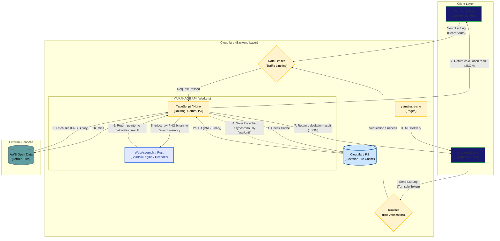

# System Architecture Diagram

This document defines the overall system architecture and provides an overview of the data flow for the YAMAKAGE app and the backend API (BFF).

## Overall System Diagram

The following diagram illustrates the overall system connections, from the clients (Garmin devices / Web) to the backend and external services (AWS Open Data).

## Component Details

### 1. Client Layer

**Garmin Device (`yamakage/source/`)**

- A Connect IQ data field app implemented in Monkey C.
- Sends latitude and longitude acquired from GPS to the API via background processing (at minimum 5-minute intervals).
- Uses Bearer token authentication with `YAMAKAGE_API_KEY` for API authentication.

**Web Application (`yamakage-site`)**

- A client that provides features for web browsers.
- Delivers static files via `Cloudflare Pages`.
- Attaches a `Cloudflare Turnstile` token to requests to prevent unauthorized access and bot requests.

### 2. Backend Layer (Cloudflare Workers)

**YAMAKAGE API (`yamakage/backend/yamakage/`)**

- A `BFF (Backends For Frontends)` built with `Cloudflare Workers + Hono`.
- **Complete Zero-Copy Hybrid Architecture**:
- The **TypeScript (Effect)** side is solely responsible for pure network I/O processing (request handling, fetching PNG tiles) and performs no heavy serialization or image decoding.
- The **WebAssembly (Rust)** side (`ShadowEngine`) handles all high-speed decoding of PNG images, extraction of elevation values, and pure, high-load in-memory simulations (determining the intersection of the solar trajectory and terrain).

- By pouring the uncompressed PNG binaries fetched on the TypeScript side directly into the Wasm shared memory space, memory bloat (garbage collection) on the JS side is prevented, drawing out extreme performance.
- To conserve the processing power and battery of the Garmin device, all these heavy computational processes are offloaded to the backend.

**Rate Limiter / Turnstile**

- To prevent API overload and DDoS attacks, the number of requests is restricted (Rate Limit) per session ID or IP address. Access from web clients is intercepted by `Turnstile` for bot verification.

**Cloudflare R2**

- Object storage that caches elevation tile images (PNG) fetched from AWS.
- Significantly reduces the number of requests to the external API and improves response speed.

### 3. External Services

**AWS Open Data ([s3.amazonaws.com/elevation-tiles-prod/](https://s3.amazonaws.com/elevation-tiles-prod/))**

- Publicly available global terrain elevation data (PNG tiles in Terrarium format).
- The system fetches from here only when an area that does not exist in the cache (R2) is requested.