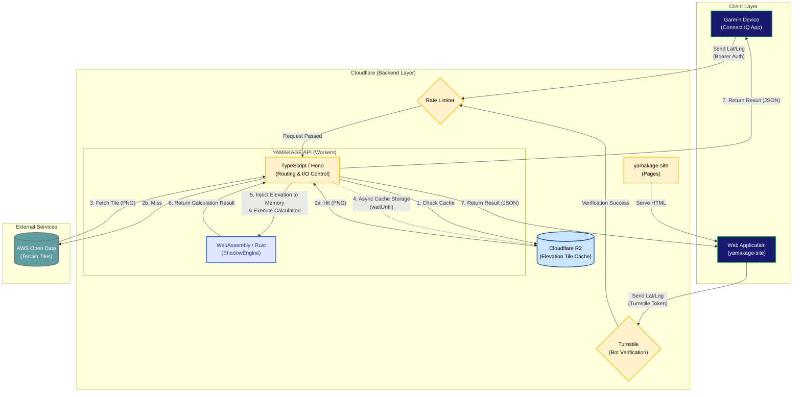

# System Architecture Document

This document defines the overall system architecture and provides an overview of the data flow for the YAMAKAGE application and its backend API (BFF).

## Overall System Architecture

The diagram below illustrates the complete system flow, connecting the clients (Garmin devices / Web) to the backend and external services (AWS Open Data).

## Component Details

### 1. Client Layer

**Garmin Device (`yamakage/source/`)**

* A Connect IQ data field app implemented in Monkey C.
* It sends latitude and longitude acquired via GPS to the API using a background process (at a minimum interval of 5 minutes).
* API authentication uses a Bearer token with the `YAMAKAGE_API_KEY`.

**Web Application (`yamakage-site`)**

* A client providing features tailored for web browsers.
* Serves static files via `Cloudflare Pages`.
* To prevent unauthorized access and bot requests, it attaches a `Cloudflare Turnstile` token to outgoing requests.

---

### 2. Backend Layer (Cloudflare Workers)

**YAMAKAGE API (`yamakage/backend/yamakage/`)**

* A `BFF (Backend For Frontends)` built with `Cloudflare Workers + Hono`.
* **Hybrid Architecture**:
* The **TypeScript (Effect)** side handles I/O operations (request routing, fetching and decoding PNG tiles).
* The **WebAssembly (Rust)** side (`ShadowEngine`) handles the pure, highly-intensive computational logic.

* Large amounts of elevation data fetched on the TypeScript side are directly written into the Wasm memory space. Wasm then executes a high-speed, in-memory simulation combining the sun's trajectory with terrain profiles.
* To preserve the Garmin device's processing power and battery life, all heavy computational workloads are completely offloaded to the backend.

**Rate Limiter / Turnstile**

* To prevent API overload and DDoS attacks, requests are restricted (Rate Limited) per session ID or IP address. Access from web clients goes through bot verification using `Turnstile`.

**Cloudflare R2**

* An object storage service used to cache elevation tile images (PNG) fetched from AWS.
* It significantly reduces the number of requests made to the external API and drastically improves response speeds.

---

### 3. External Services

**AWS Open Data ([s3.amazonaws.com/elevation-tiles-prod/](https://s3.amazonaws.com/elevation-tiles-prod/))**

* Publicly provided worldwide terrain elevation data (Terrarium format PNG tiles).
* The system only fetches data from here on a cache miss (when the requested area does not exist in R2).