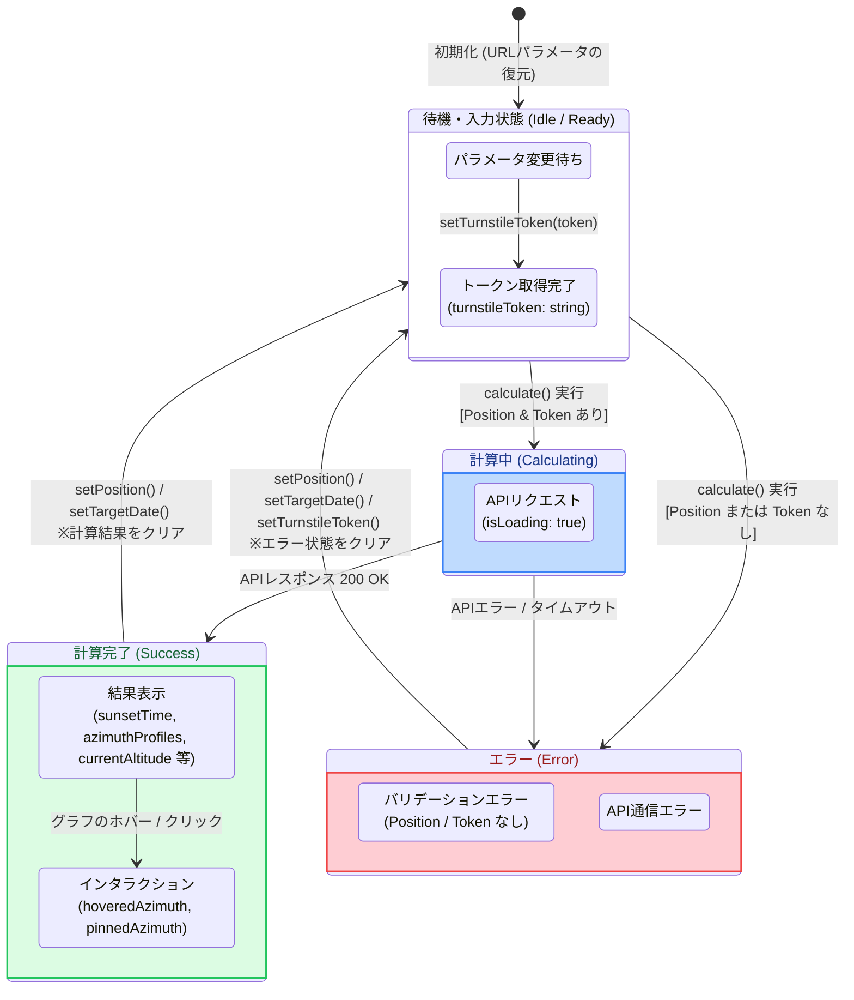

# YAMAKAGE Calculator Store 状態遷移仕様

本ドキュメントは、日没計算のコアロジックを管理する `calculatorStore.ts` （Zustand）の状態遷移と、アクション実行時の振る舞いを定義します。

## 1. 状態遷移図

アプリの起動から日没計算、およびパラメータ変更による状態のリセットまでのサイクルを示します。

## 2. Storeの責務

`calculatorStore` の主目的は以下の3点です。

1. **入力パラメータの管理**: 緯度経度（`position`）、日時（`targetDate`）、タイムゾーン（`timezone`）を保持する。
2. **計算結果の管理**: APIから取得した日没・日の出時刻、現在地の標高（`currentAltitude`）、およびグラフ描画用の地形データ（`azimuthProfiles`）を保持する。
3. **データ整合性の担保**: 「東京の計算結果が表示されているのに、地図上のピンは富士山にある」といった**UIの不整合を防ぐため、パラメータ（場所・日時）が変更された瞬間に計算結果とインタラクション状態をリセット**する。

## 3. イベントごとの状態リセット仕様

Store内の状態変更関数は、単に値をセットするだけでなく、関連するStateのクリーンアップを行います。

| アクション | トリガー | 状態変更 | 目的 |
| --- | --- | --- | --- |
| `setPosition(pos)` | 地図をクリックした時 | `position` を更新。 経度から `timezone` を自動再計算して更新。 `error`, `sunsetTime`, `sunriseTime`,`azimuthProfiles`, `sunPath`, `currentAltitude`, `hoveredAzimuth`, `pinnedAzimuth` を **null / 空配列 / 0** にリセット。 | 異なる場所の古い計算結果が画面に残り続けるのを防ぐため。 |
| `setTargetDate(date)` | カレンダーUIで日付を変えた時 | `targetDate` を更新。 計算結果系と `error`、インタラクション状態をリセット。 | 季節によって太陽の軌道は変わるため、日付変更時は計算結果を破棄して再計算を促すため。 |
| `setTimezone(tz)` | タイムゾーン選択UIを変更した時 | `timezone` を更新。 `error`, `isPolar` をリセット。 | （※注: 時刻表現の書式が変わるだけなので、通信を行わずとも結果を再フォーマット可能。そのため計算結果自体は破棄していない） |
| `setTurnstileToken(token)` | Turnstileの検証が完了した時 | `turnstileToken` を更新。 `error` をリセット。 | トークン未取得によるエラー状態から復帰させるため。 |
| `calculate()` | 計算ボタン押下時 | **【事前チェック】** `position` や `token` が無い場合は `error` に文字列をセットして終了。 **【API実行中】** `isLoading: true`, `error: null` にする。 **【成功時】** API結果を各Stateに展開し、`isLoading: false` にする。 **【失敗時】** `error` をセットし、`isLoading: false` にする。 | 計算中のUIブロックを制御し、結果を一元的にStateへ反映するため。 |
| `setHoveredAzimuth(az)` | グラフをホバーした時 | `hoveredAzimuth` を更新。 | グラフ上のカーソル位置と、地図の扇形ポリゴンの描画方向を同期させるため。 |
| `setPinnedAzimuth(az)` | グラフをクリックした時 | `pinnedAzimuth` を更新。 | 選択した方角の地形プロファイルを固定表示させるため。 |

## 4. 初期化ロジック (URLのパース)

アプリロード時に実行される `getInitialParams()` は、URLのクエリパラメータ（例: `?lat=35.36&lng=138.72&tz=Asia/Tokyo`）をパースし、Storeの初期値としてセットします。
これにより、「シェアされたURLを開いたユーザーが、共有者と全く同じ条件（場所・タイムゾーン）からスムーズに計算を開始できる」という体験を実現しています。