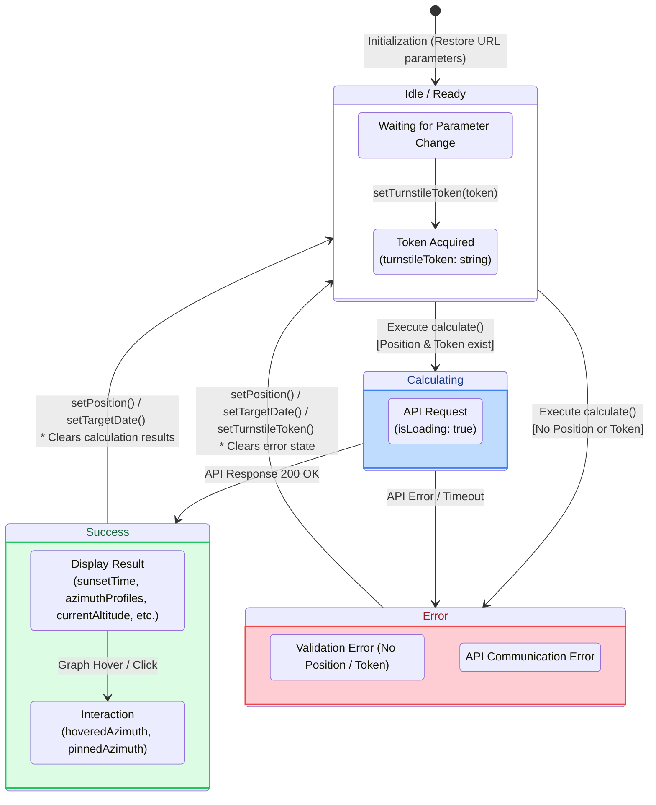

# YAMAKAGE Calculator Store State Transition Specification

This document defines the state transitions and behaviors during action execution for `calculatorStore.ts` (Zustand), which manages the core logic for sunset calculations.

## 1. State Transition Diagram

This diagram illustrates the cycle from application launch to sunset calculation, and how state resets are triggered by parameter changes.

---

## 2. Store Responsibilities

The primary purposes of the `calculatorStore` are the following three points:

* **Management of Input Parameters:** Holds the latitude and longitude (`position`), date and time (`targetDate`), and timezone (`timezone`).
* **Management of Calculation Results:** Holds the sunset and sunrise times fetched from the API, the current elevation (`currentAltitude`), and the topographical data used for rendering the graph (`azimuthProfiles`).
* **Ensuring Data Integrity:** **To prevent UI inconsistencies**—such as showing calculation results for Tokyo while the map pin is positioned on Mount Fuji—**the calculation results and interaction states are reset the exact moment a parameter (location or date) is changed**.

---

## 3. State Reset Specifications per Event

State modification functions within the Store do not simply set values; they also perform necessary cleanups of related States.

| Action | Trigger | State Change | Purpose |
| --- | --- | --- | --- |
| `setPosition(pos)` | When the map is clicked | Updates `position`. Automatically recalculates and updates `timezone` based on longitude. Resets `error`, `sunsetTime`, `sunriseTime`, `azimuthProfiles`, `sunPath`, `currentAltitude`, `hoveredAzimuth`, and `pinnedAzimuth` to **null / empty array / 0**. | To prevent outdated calculation results from a different location from lingering on the screen. |
| `setTargetDate(date)` | When the date is changed in the calendar UI | Updates `targetDate`. Resets calculation-related results, `error`, and interaction states. | Since the sun's trajectory changes with the seasons, changing the date discards the previous results to prompt a recalculation. |
| `setTimezone(tz)` | When the timezone selection UI is changed | Updates `timezone`. Resets `error` and `isPolar`. | *(Note: Because only the formatting of the time representation changes, the results can be reformatted without making new network requests. Therefore, the calculation results themselves are not discarded.)* |
| `setTurnstileToken(token)` | When Turnstile verification is complete | Updates `turnstileToken`. Resets `error`. | To recover from an error state caused by a missing token. |
| `calculate()` | When the calculate button is pressed | **[Pre-check]** If `position` or `token` is missing, sets a string to `error` and terminates. **[During API Execution]** Sets `isLoading: true`, `error: null`. **[On Success]** Applies API results to each respective State and sets `isLoading: false`. **[On Failure]** Sets `error` and sets `isLoading: false`. | To manage UI blocking during calculations and centrally reflect the results into the State. |
| `setHoveredAzimuth(az)` | When hovering over the graph | Updates `hoveredAzimuth`. | To synchronize the cursor position on the graph with the drawing direction of the fan-shaped polygon on the map. |
| `setPinnedAzimuth(az)` | When the graph is clicked | Updates `pinnedAzimuth`. | To pin and permanently display the topographical profile of the selected direction. |

---

## 4. Initialization Logic (URL Parsing)

`getInitialParams()`, which is executed when the app loads, parses the URL query parameters (e.g., `?lat=35.36&lng=138.72&tz=Asia/Tokyo`) and applies them as the initial values for the Store.
This facilitates an experience where a user opening a shared URL can smoothly begin their calculation using the exact same conditions (location and timezone) as the person who shared it.