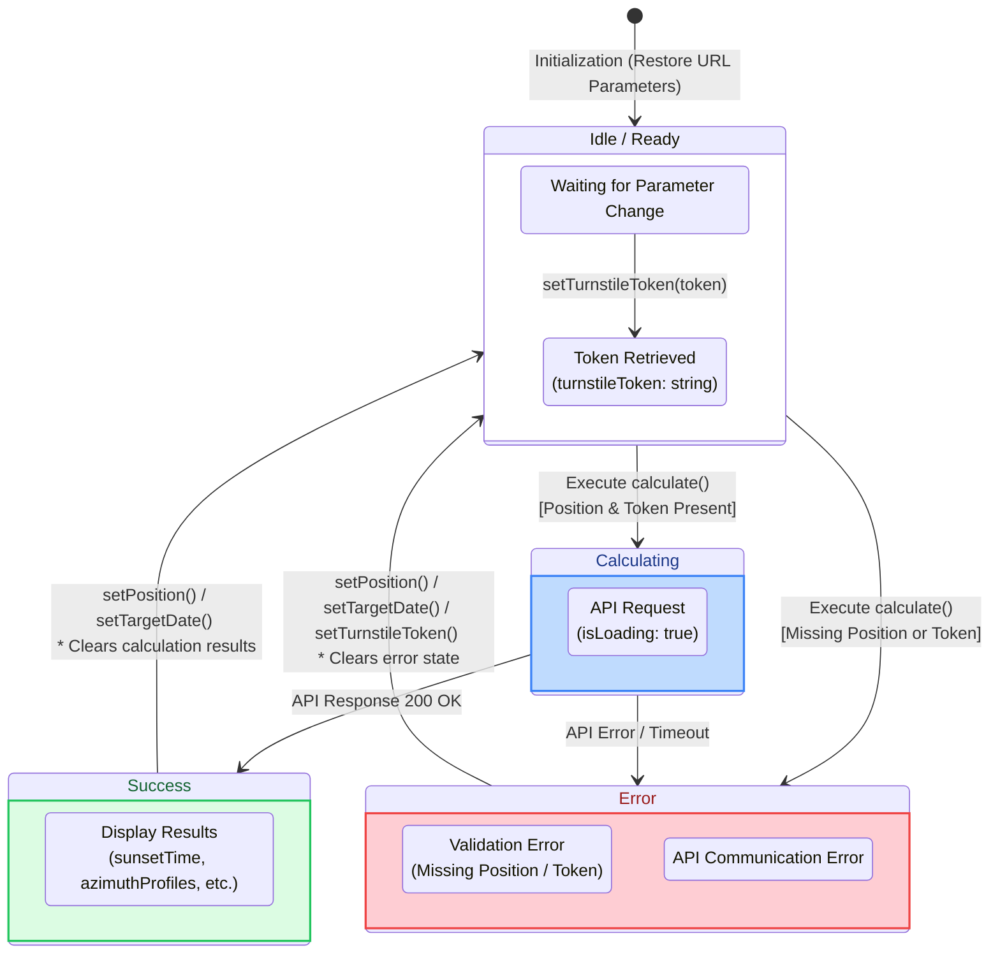

# YAMAKAGE Calculator Store State Transition Specifications

This document defines the state transitions and action behaviors of `calculatorStore.ts` (Zustand), which manages the core logic for sunset calculations.

## 1. State Transition Diagram

This diagram illustrates the cycle from application launch to sunset calculation, as well as state resets triggered by parameter changes.

## 2. Store Responsibilities

The `calculatorStore` has three main objectives:

1. **Parameter Management**: Maintains the latitude and longitude (`position`), date and time (`targetDate`), and time zone (`timezone`).
2. **Calculation Result Management**: Stores the sunset and sunrise times retrieved from the API, as well as the terrain data (`azimuthProfiles`) used for graph rendering.
3. **Data Consistency Assurance**: To prevent UI inconsistencies (e.g., "The calculation results show data for Tokyo, but the map pin is on Mt. Fuji"), it resets the calculation results the moment any parameter (location or date) is changed.

## 3. State Reset Specifications per Event

State modification functions within the Store do not merely set values; they also perform cleanup of related States.

| Action | Trigger | State Modification | Purpose |
| --- | --- | --- | --- |
| `setPosition(pos)` | When the map is clicked | Updates `position`. Automatically recalculates and updates `timezone` from the longitude. Resets `error`, `sunsetTime`, `sunriseTime`, `azimuthProfiles`, and `sunPath` to **null / empty arrays**. | To prevent old calculation results from a different location from lingering on the screen. |
| `setTargetDate(date)` | When the date is changed via the calendar UI | Updates `targetDate`. Resets calculation-related states and `error` to **null / empty arrays**. | Because the sun's trajectory changes with the seasons, changing the date discards the calculation results to prompt a recalculation. |
| `setTimezone(tz)` | When the timezone selection UI is changed | Updates `timezone`. Resets `error` and `isPolar`. | (*Note: Since this only changes the time format representation, results can be reformatted without making network requests. Therefore, the calculation results themselves are not discarded.*) |
| `setTurnstileToken(token)` | When Turnstile validation is complete | Updates `turnstileToken`. Resets `error`. | To recover from an error state caused by an unretrieved token. |
| `calculate()` | When the calculate button is pressed | **[Pre-check]** Sets a string to `error` and terminates if `position` or `token` is missing. **[API Execution]** Sets `isLoading: true` and `error: null`. **[Success]** Maps API results to respective States and sets `isLoading: false`. **[Failure]** Sets `error` and sets `isLoading: false`. | To manage UI blocking during calculation and centrally reflect the results into the State. |
| `setHoveredAzimuth(az)` | When the graph is hovered | Updates `hoveredAzimuth`. | To synchronize the cursor position on the graph with the drawing direction of the fan-shaped polygon on the map. |

## 4. Initialization Logic (URL Parsing)

The `getInitialParams()` function, executed upon application load, parses URL query parameters (e.g., `?lat=35.36&lng=138.72&tz=Asia/Tokyo`) and sets them as the Store's initial values.
This ensures a seamless experience where "a user opening a shared URL can smoothly begin calculations under the exact same conditions (location and timezone) as the person who shared it."