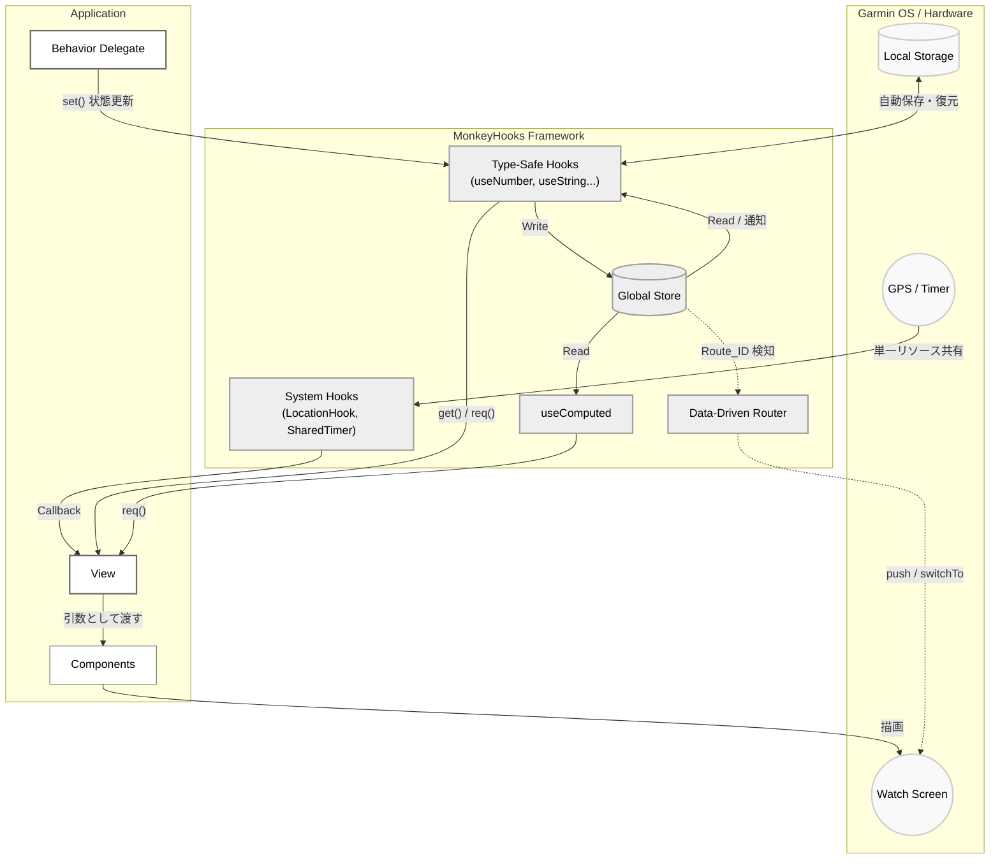

# MonkeyHooks

MonkeyHooksは、Garmin Connect IQ (Monkey C) アプリケーション開発向けの、状態管理とユーティリティを提供するライブラリです。

UIの状態管理、システムリソース（タイマーやGPS）の共有、および画面遷移などの処理を整理し、保守性を高める目的で設計されています。

---

## 基本設計

MonkeyHooksは、以下のパラダイムに基づいて設計されています。

1. **状態の一元管理:**
アプリ全体で共有される単一の `Store` を持ちます。状態はキーによって管理され、任意のコンポーネントからアクセスおよび更新が可能です。
2. **自動的な描画更新:**
状態が `set()` によって更新されると、変更を検知して自動的に `WatchUi.requestUpdate()` を呼び出し、依存するリスナーや計算プロパティを再評価します。
3. **型安全性とNullチェック:**
Monkey Cの特性に対し、`useNumber` や `useString` などの型専用コンテキストを提供します。`req()` メソッドを使用することで、値が存在することを前提とした安全なアクセス（null時は例外スロー）が可能です。
4. **オプトイン設計とリソース共有:**
必要な機能のみをプロジェクトに含めることができるモジュール構造（オプトイン設計）を採用しています。また、`SharedTimer` や `LocationHook` は、複数のコンポーネントから参照されても単一のシステムリソースを共有し、内部の弱い参照（WeakReference）によりメモリリークを防ぎます。

---

## アーキテクチャ



---

## インストール

MonkeyHooksは、Gitサブモジュールとして導入することを推奨します。

### 1. サブモジュールの追加

プロジェクトのルートディレクトリで以下のコマンドを実行し、ライブラリを追加します。

```bash
git submodule add https://github.com/[YOUR_USERNAME]/monkey-hooks.git lib/monkey-hooks

```

### 2. `monkey.jungle` の設定

アプリケーションのルートにある `monkey.jungle` を編集し、コンパイル対象のソースパスに MonkeyHooks の `src` フォルダを追加します。

```jungle
project.manifest = manifest.xml

# 既存の source に加えて、サブモジュールの src フォルダを指定
base.sourcePath = source;lib/monkey-hooks/src

```

### 機能の取捨選択（オプトイン）について

MonkeyHooks は `core` フォルダと `options` フォルダに分かれています。ファイルサイズやメモリ使用量を最小限に抑えたい場合は、サブモジュールではなく手動でファイルをコピーし、`options` フォルダ内の不要な機能（例: `router`, `watch` など）をフォルダごと削除して使用することができます。欠損した機能はコンパイル時に自動的に無視されます。

---

## 使用方法

### 1. 基本的な状態管理

型に応じたフック（`useNumber`, `useString`, `useBoolean`, `useFloat` など）を使用して状態を読み書きします。

```monkeyc
import Toybox.WatchUi;
import Toybox.Lang;

class MyView extends WatchUi.View {
    private var _counter = MonkeyHooks.useNumber(:counter);

    function initialize() {
        View.initialize();
        _counter.init(0); // 初期値の設定（値が存在する場合は無視される）
    }

    function onUpdate(dc) {
        dc.setColor(Graphics.COLOR_WHITE, Graphics.COLOR_BLACK);
        dc.clear();
        
        var currentValue = _counter.req(); // 値の取得（null時は例外スロー）
        dc.drawText(100, 100, Graphics.FONT_LARGE, "Count: " + currentValue, Graphics.TEXT_JUSTIFY_CENTER);
    }
}

class MyDelegate extends WatchUi.BehaviorDelegate {
    private var _counter = MonkeyHooks.useNumber(:counter);

    function onSelect() {
        _counter.set(_counter.req() + 1); // 状態を更新（自動で描画更新がトリガーされる）
        return true;
    }
}

```

### 2. 計算プロパティ (useComputed)

他の状態に依存して計算される派生状態を作成します。依存する状態が変化したときのみ再計算が行われます。

```monkeyc
class BmiCalculator {
    function calcBmi(deps as Array) as Float {
        var w = deps[0].toFloat();
        var h = deps[1].toFloat() / 100.0;
        return (w / (h * h)).toFloat();
    }
}

var _bmiCalculator = new BmiCalculator();

class UserProfile {
    private var _weight = MonkeyHooks.useNumber(:weight).init(70);
    private var _height = MonkeyHooks.useNumber(:height).init(175);
    
    private var _bmi = MonkeyHooks.useComputed(
        :bmi,
        [:weight, :height],
        _bmiCalculator.methoc(:calcBmi);
    );

    function printBmi() {
        System.println("BMI: " + _bmi.req());
    }
}

```

### 3. 状態の監視 (watch)

状態が変化した際にコールバックを実行します。

```monkeyc
class Logger {
    function onShow() as Void {
        MonkeyHooks.watch(self, :onCounterChanged, [:counter]);
    }

    function onHide() as Void {
        MonkeyHooks.unwatch(self, :onCounterChanged);
    }

    function onCounterChanged(currentValues as Array) as Void {
        System.println("Counter: " + currentValues[0]);
    }
}

```

### 4. コレクション型の操作と強制更新 (forceSet)

Monkey Cの仕様上、配列や辞書は参照比較（`!=`）が行われます。そのため、既存の配列の中身を追加・変更して通常の `set()` を呼び出しても、変更として検知されません。

配列の要素などを直接操作した場合は、参照比較をスキップして強制的に更新をトリガーする `forceSet()` を使用してください。

```monkeyc
var arrHook = MonkeyHooks.useArray(:myList);
var list = arrHook.req();

list.add("New Item"); // 配列の中身を変更（参照は同じ）

// arrHook.set(list); // 参照が同一のため無視される
arrHook.forceSet(list); // 強制的に更新通知と再描画を実行

```

※ 頻繁に更新される状態は、巨大な辞書にまとめるのではなく、プリミティブな型（Number等）に分割して管理することが推奨されます。

### 5. 永続化ストレージ (useStorageString)

`Application.Storage` と連携し、アプリ終了後も保持される状態を作成します。

```monkeyc
var userName = MonkeyHooks.useStorageString("username").init("Guest");
userName.set("Bob"); // Storeの更新と Storage.setValue() が同時に実行される

```

### 6. リソース共有 (SharedTimer / LocationHook)

システムリソースを安全に共有します。最初のリスナーが登録された時点でリソースが起動し、リスナーがゼロになると自動で停止します。

#### SharedTimer

```monkeyc
class MainView extends WatchUi.View {
    function onShow() {
        MonkeyHooks.SharedTimer.subscribe(self, :onTick);
    }

    function onTick() as Void {
        // 一定間隔ごとの処理
    }

    function onHide() {
        MonkeyHooks.SharedTimer.unsubscribe(self, :onTick);
    }
}

```

間隔を変更する場合は、初期化時に `MonkeyHooks.SharedTimer.setInterval(200);` のように設定します（デフォルトは100ms）。

#### LocationHook

```monkeyc
class MainView extends WatchUi.View {
    function onShow() {
        MonkeyHooks.LocationHook.subscribe(self, :onLocationUpdated);
    }

    function onLocationUpdated(info as Position.Info) as Void {
        if (info.position != null) {
            System.println("Lat: " + info.position.toDegrees()[0]);
        }
    }
}

```

### 7. ルーティング (MonkeyRouter)

ViewとDelegateの生成を管理し、画面遷移を行います。

```monkeyc
function onStart(state) {
    MonkeyHooks.Router.initialize(method(:viewFactory));
}

function viewFactory(routeId as Number) as Array? {
    switch(routeId) {
        case 1: return [new HomeView(), new HomeDelegate()];
        case 2: return [new SettingsView(), null];
    }
    return null;
}

```

```monkeyc
MonkeyHooks.Router.push(1, WatchUi.SLIDE_LEFT);
MonkeyHooks.Router.switchTo(2, WatchUi.SLIDE_IMMEDIATE);

```

---

## ベストプラクティス

### キーの一元管理 (Enumの使用)

状態キーは `enum` を使用して一元管理することを推奨します。

```monkeyc
module AppState {
    enum {
        DISPLAY_WIDTH,
        DISPLAY_HEIGHT
    }
}

// 呼び出し側
var w = MonkeyHooks.useNumber(AppState.DISPLAY_WIDTH).req();

```

### カスタム型の追加

プロジェクト固有のデータ型を扱うためのコンテキストを追加することができます。以下の構造を参考に、独自のコンテキストクラスと取得関数を定義してください。

```monkeyc
typedef UserProfile as Dictionary<String, String or Number>;

class ProfileContext {
    private var _cx as MonkeyHooks.Context;
    function initialize(cx as MonkeyHooks.Context) { _cx = cx; }
    
    function get() as UserProfile? { return _cx.get() as UserProfile?; }
    function req() as UserProfile { 
        var val = _cx.get();
        if (val == null) { throw new Lang.InvalidValueException("Profile req() failed."); }
        return val as UserProfile;
    }
    function set(val as UserProfile?) as Void { _cx.set(val); }
    function forceSet(val as UserProfile?) as Void { _cx.forceSet(val); }
    function init(val as UserProfile) as ProfileContext { _cx.init(val); return self; }
}

function useProfile(key as Object) as ProfileContext {
    return new ProfileContext(MonkeyHooks.useArena(key));
}

```

## ライセンス

MIT License
Copyright (c) 2026 Ichimura Tomoo