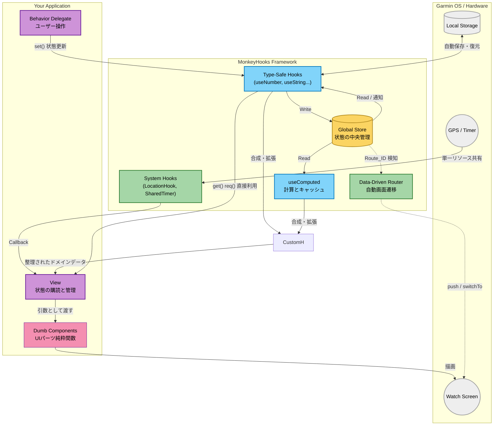

# 🐒 MonkeyHooks

MonkeyHooksは、Garmin Connect IQ (MonkeyC) アプリケーション開発のための、**リアクティブな状態管理とフック指向のユーティリティライブラリ**です。

Reactの `useState` や `useMemo`、`useEffect` のような直感的なAPIを提供し、複雑になりがちなGarminアプリのUI状態管理、システムリソース（タイマーやGPS）の共有、および画面遷移をシンプルかつ安全に構築できるように設計されています。

---

## 思想

MonkeyHooksは、以下の4つのコアパラダイムに基づいて設計されています。

1. **単一の信頼できる情報源:**
アプリ全体で共有されるグローバルな `Store` を裏側で持ちます。状態（State）はキー（通常はSymbol）によって一元管理され、どこからでもアクセス・更新が可能です。
2. **自動的なリアクティビティ:**
状態が `set()` によって更新されると、変更を検知して自動的に `WatchUi.requestUpdate()` を呼び出し、さらにその状態に依存するリスナーや `Computed`（計算プロパティ）を再評価します。開発者が手動で描画更新をトリガーする必要はありません。
3. **型安全性とNull安全の強化:**
MonkeyCのダックタイピングな特性に対し、`useNumber` や `useString` といった型専用のコンテキストを提供します。また、値が必ず存在することを保証する `req()` メソッド（nullの場合は例外をスロー）により、安全なプログラミングを促進します。
4. **システムリソースの最適化と自動メモリ管理:**
`SharedTimer` や `LocationHook` は、複数のコンポーネントからサブスクライブされても単一のシステムリソースを共有します。また、内部で `WeakReference`（弱い参照）を用いることで、Monkey C特有の循環参照によるメモリリークを自動的に防ぎます。

---

## アーキテクチャ



## 🚀 インストール

本リポジトリの `source/lib/monkey-hooks/` ディレクトリをご自身のプロジェクトの `source/` ディレクトリ等に配置してください。すべてのモジュールは `MonkeyHooks` モジュール名前空間の下に提供されます。

---

## 📖 使用方法

### 1. 基本的な状態管理

状態を読み書きするための基本フックです。型に応じたフック（`useNumber`, `useString`, `useBoolean`, `useFloat`, `useFont`, `useColor`）が用意されています。

```monkeyc
import Toybox.WatchUi;
import Toybox.Lang;

class MyView extends WatchUi.View {
    // :counterというキーでNumber型の状態を管理
    private var _counter = MonkeyHooks.useNumber(:counter);

    function initialize() {
        View.initialize();
        // 初期値を設定（既に値が存在する場合は無視されます）
        _counter.init(0);
    }

    function onUpdate(dc) {
        dc.setColor(Graphics.COLOR_WHITE, Graphics.COLOR_BLACK);
        dc.clear();
        
        // get() は null を許容。req() は非nullを保証（null時はクラッシュ）
        var currentValue = _counter.req();
        dc.drawText(100, 100, Graphics.FONT_LARGE, "Count: " + currentValue, Graphics.TEXT_JUSTIFY_CENTER);
    }
}

// どこか別のデリゲートクラスなどで値を更新
class MyDelegate extends WatchUi.BehaviorDelegate {
    private var _counter = MonkeyHooks.useNumber(:counter);

    function onSelect() {
        // 値を更新すると、自動で WatchUi.requestUpdate() が呼ばれる
        _counter.set(_counter.req() + 1);
        return true;
    }
}

```

### 2. 計算プロパティ (useComputed)

他の状態に依存して自動的に計算される派生状態を作成します。依存する状態（Deps）が変化したときのみ再計算されるため、パフォーマンスに優れています。

```monkeyc
class UserProfile {
    private var _weight = MonkeyHooks.useNumber(:weight).init(70);
    private var _height = MonkeyHooks.useNumber(:height).init(175);
    
    // BMIを計算するComputedプロパティ
    private var _bmi = MonkeyHooks.useComputed(
        :bmi,               // 保存先のキー
        [:weight, :height], // 依存する状態のキー配列
        method(:calcBmi)    // 計算用メソッド
    );

    // 依存する値が配列として渡される
    function calcBmi(deps as Array) as Float {
        var w = deps[0] as Number;
        var h = (deps[1] as Number) / 100.0;
        return w / (h * h);
    }

    function printBmi() {
        // weightやheightが変わった時だけ calcBmi が走り、それ以外はキャッシュを返す
        System.println("BMI: " + _bmi.req());
    }
}

```

### 3. 状態の監視 (useWatch)

特定の実装状態が変化した際に、副作用を実行するためのフックです。

```monkeyc
class Logger {
    function onShow() as Void {
        MonkeyHooks.watch(
            self,
            :onCounterChanged,
            [:counter]
        );
    }

    function onHide() as Void {
        MonkeyHooks.unwatch(self, :onCounterChanged);
    }

    function onCounterChanged(currentValues as Array) as Void {
        System.println("Counter is now: " + currentValues[0]);
    }
}

```

### 4. 永続化ストレージフック (useStorageString)

`Application.Storage` と連携し、アプリ終了後も保持される状態を簡単に作成します。

```monkeyc
// "username" キーでストレージに保存しつつ、メモリ上のStoreとも同期する
var userName = MonkeyHooks.useStorageString("username").init("Guest");

// これを呼ぶと、メモリ上のStoreが更新されると同時に Storage.setValue() が実行される
userName.set("Bob"); 

```

### 5. リソース共有フック (SharedTimer / LocationHook)

高コストなリソースを安全に共有します。最初のリスナーが登録された時点でリソースが起動し、リスナーがゼロになると自動で停止します。

**メモリリークフリーな設計**

Monkey C特有の循環参照（Viewがメソッドを持ち、メソッドが暗黙的にViewの強参照を持つ問題）を防ぐため、`method(:...)` ではなく、対象オブジェクト(`self`)とメソッド名（シンボル）を渡す設計になっています。
ライブラリ内部では `WeakReference`（弱い参照）として保持されるため、Viewが破棄されると自動的にリスナーのリストからクリーンアップされます。手動での煩雑な `null` 代入などは不要です。

#### SharedTimer

一定間隔ごとにTickを発生させる共有タイマーです。アニメーションや定期処理に最適です。

```monkeyc
function onShow() {
    // 実行先インスタンス(self)とメソッド名のシンボルを渡すだけ
    MonkeyHooks.SharedTimer.subscribe(self, :onTick);
}

function onTick() as Void {
    // 一定間隔ごとに呼ばれる処理
}

function onHide() {
    // 登録解除（他のリスナーがいなくなればTimerは自動停止する）
    MonkeyHooks.SharedTimer.unsubscribe(self, :onTick);
}

```

フレームレートはデフォルトで`100ms`です。
この間隔を変更したい場合は、以下のようにアプリのエンドポイントなどで変更してください。

```monkeyc
class YourApp extends Application.AppBase {
    function initialize() {
        AppBase.initialize();
        // アプリ全体のアニメーションベースを 200ms (5fps) に設定してバッテリーを節約
        MonkeyHooks.SharedTimer.setInterval(200); 
    }
}
```
このタイマーはアプリ内でシングルトンなため、重複して設定した場合は後に設定した値で上書きされます。


#### LocationHook

共有のGPS（Position）イベントリスナーです。

```monkeyc
function onShow() {
    MonkeyHooks.LocationHook.subscribe(self, :onLocationUpdated);
}

function onLocationUpdated(info as Position.Info) as Void {
    System.println("Lat: " + info.position.toDegrees()[0]);
}

function onHide() {
    MonkeyHooks.LocationHook.unsubscribe(self, :onLocationUpdated);
}

```

### 6. ルーティング (MonkeyRouter)

ViewとDelegateの生成を中央管理し、画面遷移をスマートに行います。

**初期設定:**

```monkeyc
// App.mc などで初期化
function onStart(state) {
    MonkeyHooks.Router.initialize(method(:viewFactory));
}

// Route IDを受け取り、[View, Delegate] の配列を返すファクトリー
function viewFactory(routeId as Number) as Array? {
    switch(routeId) {
        case 1:
            return [new HomeView(), new HomeDelegate()];
        case 2:
            return [new SettingsView(), null];
    }
    return null;
}

```

**画面遷移:**

```monkeyc
// Home画面へ遷移 (pushViewと同等)
MonkeyHooks.Router.push(1, WatchUi.SLIDE_LEFT);

// 現在の画面を置き換え (switchToViewと同等)
MonkeyHooks.Router.switchTo(2, WatchUi.SLIDE_IMMEDIATE);

```

---

## 中・大規模開発におけるベストプラクティス

### キーの集中管理 (Enumの使用)

小規模なアプリや一時的なローカル状態の管理にはシンボル（`:counter` など）が便利ですが、アプリの規模が大きくなるとタイポ（スペルミス）によるバグが発生しやすくなります。
中規模以上の開発では、`enum` を使用してグローバルな状態キーを一元管理することを推奨します。

```monkeyc
// 状態キーをモジュールとenumで一元管理
module AppState {
    enum {
        DISPLAY_WIDTH,
        DISPLAY_HEIGHT,
        IS_GPS_READY,
        USER_PROFILE
    }
}

class MainView extends WatchUi.View {
    function onUpdate(dc) {
        // enumを利用することでタイポを防ぎ、IDEのコード補完も効きやすくなります
        var w = MonkeyHooks.useNumber(AppState.DISPLAY_WIDTH).req();
        var isReady = MonkeyHooks.useBoolean(AppState.IS_GPS_READY).init(false).req();
        // ...
    }
}

```

### カスタム型の追加手法

MonkeyHooks は基本型（Number, String 等）のラッパーを標準提供していますが、プロジェクト固有のデータ型（独自のDictionary構成や配列、カスタムクラスなど）を安全に扱うための独自型を追加できます。

`MonkeyHooks.mc` の末尾にある `Custom Type Interface Template` をコピーし、独自の型（例: `UserProfile`）に置き換えて使用します。

**実装例:**

```monkeyc
import Toybox.Lang;
import MonkeyHooks;

// 1. プロジェクト固有の型を定義
typedef UserProfile as Dictionary<String, String or Number>;

// 2. テンプレートを利用して専用のコンテキストクラスを作成
class ProfileContext {
    private var _cx as MonkeyHooks.Context;
    function initialize(cx as MonkeyHooks.Context) { _cx = cx; }
    
    function get() as UserProfile? { return _cx.get() as UserProfile?; }
    function req() as UserProfile { 
        var val = _cx.get();
        if (val == null) { throw new Lang.InvalidValueException("MonkeyHooks: UserProfile req() failed."); }
        return val as UserProfile;
    }
    function set(val as UserProfile?) as Void { _cx.set(val); }
    function setSilent(val as UserProfile?) as Void { _cx.setSilent(val); }
    function init(val as UserProfile) as ProfileContext { _cx.init(val); return self; }
    function subscribe(listener as Lang.Method) as Void { _cx.subscribe(listener); }
    function unsubscribe(listener as Lang.Method) as Void { _cx.unsubscribe(listener); }
}

// 3. 専用のフック関数を定義
function useProfile(key as Object) as ProfileContext {
    return new ProfileContext(MonkeyHooks.useArena(key));
}

```

**使用例:**

```monkeyc
// コンパイラは確実に UserProfile 型（Dictionary）として認識するため、
// 利用側での `as` キャストが不要になります。
var profile = useProfile(AppState.USER_PROFILE).req();
var name = profile["name"];

```

## 📄 ライセンス (License)

MIT License
Copyright (c) 2026 Ichimura Tomoo