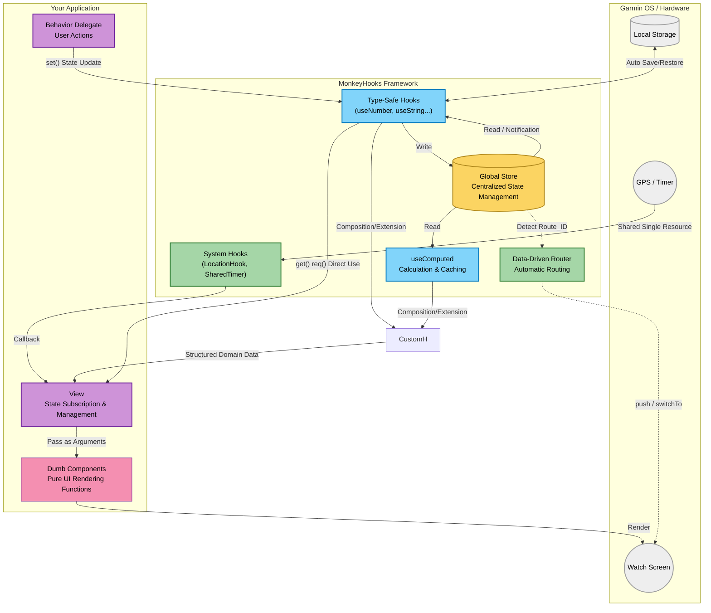

# 🐒 MonkeyHooks

MonkeyHooks is a **reactive state management and hooks-oriented utility library** designed for Garmin Connect IQ (MonkeyC) application development.

It provides intuitive APIs similar to React's `useState`, `useMemo`, and `useEffect`. It is designed to help you easily and safely build complex Garmin app UI state management, shared system resources (timers and GPS), and screen routing.

---

## Philosophy

MonkeyHooks is built upon four core paradigms:

1. **Single Source of Truth:**
Backed by a global `Store` shared across the entire application. State is managed centrally via keys (typically Symbols), allowing access and updates from anywhere.
2. **Automatic Reactivity:**
When state is updated via `set()`, it detects the change, automatically calls `WatchUi.requestUpdate()`, and re-evaluates dependent listeners and `Computed` properties. Developers do not need to manually trigger render updates.
3. **Enhanced Type and Null Safety:**
To address MonkeyC's duck-typing nature, it provides type-specific contexts such as `useNumber` and `useString`. Furthermore, the `req()` method guarantees the presence of a value (throwing an exception if null), promoting safe programming.
4. **System Resource Optimization and Automatic Memory Management:**
`SharedTimer` and `LocationHook` share a single underlying system resource (`Timer.Timer` or `Position` events) even if subscribed to by multiple components. By using `WeakReference` internally, it automatically prevents memory leaks caused by Monkey C's characteristic circular references.

---

## Architecture



## Installation

Place the `source/lib/monkey-hooks/` directory from this repository into your project's `source/` directory. All modules are provided under the `MonkeyHooks` module namespace.

---

## Usage

### 1. Basic State Management

Basic hooks for reading and writing state. Type-specific hooks (`useNumber`, `useString`, `useBoolean`, `useFloat`, `useFont`, `useColor`) are provided.

```monkeyc
import Toybox.WatchUi;
import Toybox.Lang;

class MyView extends WatchUi.View {
    // Manage a Number state with the key :counter
    private var _counter = MonkeyHooks.useNumber(:counter);

    function initialize() {
        View.initialize();
        // Set the initial value (ignored if a value already exists)
        _counter.init(0);
    }

    function onUpdate(dc) {
        dc.setColor(Graphics.COLOR_WHITE, Graphics.COLOR_BLACK);
        dc.clear();
        
        // get() allows null. req() guarantees a non-null value (crashes if null)
        var currentValue = _counter.req();
        dc.drawText(100, 100, Graphics.FONT_LARGE, "Count: " + currentValue, Graphics.TEXT_JUSTIFY_CENTER);
    }
}

// Update values in a delegate class or elsewhere
class MyDelegate extends WatchUi.BehaviorDelegate {
    private var _counter = MonkeyHooks.useNumber(:counter);

    function onSelect() {
        // Updating the value automatically triggers WatchUi.requestUpdate()
        _counter.set(_counter.req() + 1);
        return true;
    }
}

```

### 2. Computed Properties (useComputed)

Creates derived state that is automatically calculated based on other states. It provides excellent performance by recalculating only when the dependent states (Deps) change.

```monkeyc
class UserProfile {
    private var _weight = MonkeyHooks.useNumber(:weight).init(70);
    private var _height = MonkeyHooks.useNumber(:height).init(175);
    
    // Computed property to calculate BMI
    private var _bmi = MonkeyHooks.useComputed(
        :bmi,               // Storage key
        [:weight, :height], // Array of dependent state keys
        method(:calcBmi)    // Calculation method
    );

    // Dependent values are passed as an Array
    function calcBmi(deps as Array) as Float {
        var w = deps[0] as Number;
        var h = (deps[1] as Number) / 100.0;
        return w / (h * h);
    }

    function printBmi() {
        // calcBmi runs only when weight or height changes; otherwise, it returns the cached value
        System.println("BMI: " + _bmi.req());
    }
}

```

### 3. State Watching (useWatch)

A hook for executing side effects (callbacks) when specific state values change. This is equivalent to React's `useEffect`.

```monkeyc
class Logger {
    function onShow() as Void {
        MonkeyHooks.watch(
            self,
            :onCounterChanged,
            [:counter]
        );
    }

    function onHide() as Void {
        MonkeyHooks.unwatch(self, :onCounterChanged);
    }

    function onCounterChanged(currentValues as Array) as Void {
        System.println("Counter is now: " + currentValues[0]);
    }
}
```

### 4. Persistent Storage Hook (useStorageString)

Integrates with `Application.Storage` to easily create state that is retained even after the app closes.

```monkeyc
// Saves to storage under the "username" key while syncing with the in-memory Store
var userName = MonkeyHooks.useStorageString("username").init("Guest");

// Calling this updates the in-memory Store and executes Storage.setValue() simultaneously
userName.set("Bob"); 

```

### 5. Resource Sharing Hooks (SharedTimer / LocationHook)

Safely shares high-cost resources. The resource starts when the first listener is registered and automatically stops when the listener count drops to zero.

**Memory-Leak Free Design**

To prevent Monkey C's characteristic circular references (the problem where a View holds a method, and the method implicitly holds a strong reference to the View), the design requires passing the target object (`self`) and the method name (symbol) instead of `method(:...)`.
Since it is held internally as a `WeakReference`, it is automatically cleaned up from the listener list when the View is destroyed. Troublesome manual `null` assignments are completely unnecessary.

#### SharedTimer

A shared timer that triggers a tick at regular intervals. Ideal for animations and periodic processing.

```monkeyc
function onShow() {
    // Just pass the target instance (self) and the method name symbol
    MonkeyHooks.SharedTimer.subscribe(self, :onTick);
}

function onTick() as Void {
    // Process called at regular intervals
}

function onHide() {
    // Unsubscribe (the Timer automatically stops if no other listeners remain)
    MonkeyHooks.SharedTimer.unsubscribe(self, :onTick);
}

```

The default frame rate is `100ms`.
If you want to change this interval, modify it at the app's entry point as follows:

```monkeyc
class YourApp extends Application.AppBase {
    function initialize() {
        AppBase.initialize();
        // Set the app's global animation base to 200ms (5fps) to save battery
        MonkeyHooks.SharedTimer.setInterval(200); 
    }
}

```

Since this timer acts as a singleton within the app, if set multiple times, it will be overwritten by the last provided value.

#### LocationHook

A shared GPS (Position) event listener.

```monkeyc
function onShow() {
    MonkeyHooks.LocationHook.subscribe(self, :onLocationUpdated);
}

function onLocationUpdated(info as Position.Info) as Void {
    System.println("Lat: " + info.position.toDegrees()[0]);
}

function onHide() {
    MonkeyHooks.LocationHook.unsubscribe(self, :onLocationUpdated);
}

```

### 6. Routing (MonkeyRouter)

Centrally manages View and Delegate creation to handle screen transitions cleanly.

**Initial Setup:**

```monkeyc
// Initialize in App.mc, etc.
function onStart(state) {
    MonkeyHooks.Router.initialize(method(:viewFactory));
}

// Factory that receives a Route ID and returns an array of [View, Delegate]
function viewFactory(routeId as Number) as Array? {
    switch(routeId) {
        case 1:
            return [new HomeView(), new HomeDelegate()];
        case 2:
            return [new SettingsView(), null];
    }
    return null;
}

```

**Screen Transition:**

```monkeyc
// Transition to Home screen (equivalent to pushView)
MonkeyHooks.Router.push(1, WatchUi.SLIDE_LEFT);

// Replace the current screen (equivalent to switchToView)
MonkeyHooks.Router.switchTo(2, WatchUi.SLIDE_IMMEDIATE);

```

---

## Best Practices for Medium to Large-Scale Development

### Centralized Key Management (Using Enums)

Symbols (like `:counter`) are convenient for small apps or temporary local states, but as the app scales, typos can lead to bugs.
For medium to large-scale development, using an `enum` to centrally manage global state keys is recommended.

```monkeyc
// Centrally manage state keys using a module and enum
module AppState {
    enum {
        DISPLAY_WIDTH,
        DISPLAY_HEIGHT,
        IS_GPS_READY,
        USER_PROFILE
    }
}

class MainView extends WatchUi.View {
    function onUpdate(dc) {
        // Using enums prevents typos and enhances IDE auto-completion
        var w = MonkeyHooks.useNumber(AppState.DISPLAY_WIDTH).req();
        var isReady = MonkeyHooks.useBoolean(AppState.IS_GPS_READY).init(false).req();
        // ...
    }
}

```

### Adding Custom Types

While MonkeyHooks provides out-of-the-box wrappers for primitive types (Number, String, etc.), you can create custom types to safely handle project-specific data structures (custom Dictionary schemas, arrays, custom classes, etc.).

Copy the `Custom Type Interface Template` found at the end of `MonkeyHooks.mc` and adapt it for your custom type (e.g., `UserProfile`).

**Implementation Example:**

```monkeyc
import Toybox.Lang;
import MonkeyHooks;

// 1. Define your project-specific type
typedef UserProfile as Dictionary<String, String or Number>;

// 2. Create a dedicated context class using the template
class ProfileContext {
    private var _cx as MonkeyHooks.Context;
    function initialize(cx as MonkeyHooks.Context) { _cx = cx; }
    
    function get() as UserProfile? { return _cx.get() as UserProfile?; }
    function req() as UserProfile { 
        var val = _cx.get();
        if (val == null) { throw new Lang.InvalidValueException("MonkeyHooks: UserProfile req() failed."); }
        return val as UserProfile;
    }
    function set(val as UserProfile?) as Void { _cx.set(val); }
    function setSilent(val as UserProfile?) as Void { _cx.setSilent(val); }
    function init(val as UserProfile) as ProfileContext { _cx.init(val); return self; }
    function subscribe(listener as Lang.Method) as Void { _cx.subscribe(listener); }
    function unsubscribe(listener as Lang.Method) as Void { _cx.unsubscribe(listener); }
}

// 3. Define a dedicated hook function
function useProfile(key as Object) as ProfileContext {
    return new ProfileContext(MonkeyHooks.useArena(key));
}

```

**Usage Example:**

```monkeyc
// The compiler guarantees this is a UserProfile type (Dictionary),
// eliminating the need for `as` casting on the consumer side.
var profile = useProfile(AppState.USER_PROFILE).req();
var name = profile["name"];

```

## 📄 License

MIT License
Copyright (c) 2026 Ichimura Tomoo