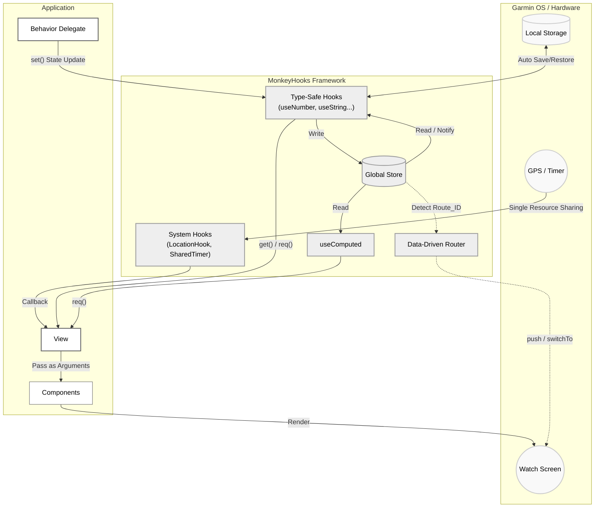

# MonkeyHooks

MonkeyHooks is a state management and utility library for Garmin Connect IQ (Monkey C) application development.

It is designed to organize processes such as UI state management, system resource sharing (timers, GPS), and screen navigation, thereby improving maintainability.

---

## Core Concepts

MonkeyHooks is designed based on the following paradigms:

1. **Centralized State Management:**
It features a single `Store` shared across the entire application. State is managed by keys and can be accessed and updated from any component.
2. **Automatic UI Updates:**
When the state is updated via `set()`, the library detects the change and automatically calls `WatchUi.requestUpdate()`, re-evaluating dependent listeners and computed properties.
3. **Type Safety and Null Checking:**
To accommodate Monkey C's characteristics, it provides type-specific contexts such as `useNumber` and `useString`. By using the `req()` method, you can safely access values assuming they exist (an exception is thrown if the value is null).
4. **Opt-in Design and Resource Sharing:**
It adopts a modular structure (opt-in design) that allows you to include only the necessary features in your project. Additionally, utilities like `SharedTimer` and `LocationHook` share a single system resource even when referenced by multiple components, preventing memory leaks through internal weak references (`WeakReference`).

---

## Architecture



---

## Installation

We recommend introducing MonkeyHooks as a Git submodule.

### 1. Adding the Submodule

Run the following command in the root directory of your project to add the library:

```bash
git submodule add https://github.com/[YOUR_USERNAME]/monkey-hooks.git lib/monkey-hooks


```

### 2. Configuring `monkey.jungle`

Edit the `monkey.jungle` file at the root of your application and add the MonkeyHooks `src` folder to your compile source path.

```jungle
project.manifest = manifest.xml

# Add the submodule's src folder in addition to the existing source path
base.sourcePath = source;lib/monkey-hooks/src


```

### Feature Selection (Opt-in)

MonkeyHooks is divided into `core` and `options` folders. If you want to minimize file size and memory usage, you can manually copy the files instead of using a submodule, and delete the folders of unnecessary features (e.g., `router`, `watch`) inside the `options` folder. Missing features will automatically be ignored during compilation.

---

## Usage

### 1. Basic State Management

Read and write state using type-specific hooks (e.g., `useNumber`, `useString`, `useBoolean`, `useFloat`).

```monkeyc
import Toybox.WatchUi;
import Toybox.Lang;

class MyView extends WatchUi.View {
    private var _counter = MonkeyHooks.useNumber(:counter);

    function initialize() {
        View.initialize();
        _counter.init(0); // Set initial value (ignored if the value already exists)
    }

    function onUpdate(dc) {
        dc.setColor(Graphics.COLOR_WHITE, Graphics.COLOR_BLACK);
        dc.clear();
        
        var currentValue = _counter.req(); // Get the value (throws an exception if null)
        dc.drawText(100, 100, Graphics.FONT_LARGE, "Count: " + currentValue, Graphics.TEXT_JUSTIFY_CENTER);
    }
}

class MyDelegate extends WatchUi.BehaviorDelegate {
    private var _counter = MonkeyHooks.useNumber(:counter);

    function onSelect() {
        _counter.set(_counter.req() + 1); // Update the state (automatically triggers UI redraw)
        return true;
    }
}


```

### 2. Computed Properties (useComputed)

Create derived state that is calculated based on other states. Recalculation only occurs when the dependent states change.

```monkeyc
class BmiCalculator {
    function calcBmi(deps as Array) as Float {
        var w = deps[0].toFloat();
        var h = deps[1].toFloat() / 100.0;
        return (w / (h * h)).toFloat();
    }
}

var _bmiCalculator = new BmiCalculator();

class UserProfile {
    private var _weight = MonkeyHooks.useNumber(:weight).init(70);
    private var _height = MonkeyHooks.useNumber(:height).init(175);
    
    private var _bmi = MonkeyHooks.useComputed(
        :bmi,
        [:weight, :height],
        _bmiCalculator.method(:calcBmi) // Note: corrected 'methoc' typo from source
    );

    function printBmi() {
        System.println("BMI: " + _bmi.req());
    }
}


```

### 3. State Watching (watch)

Execute callbacks when a specific state changes.

```monkeyc
class Logger {
    function onShow() as Void {
        MonkeyHooks.watch(self, :onCounterChanged, [:counter]);
    }

    function onHide() as Void {
        MonkeyHooks.unwatch(self, :onCounterChanged);
    }

    function onCounterChanged(currentValues as Array) as Void {
        System.println("Counter: " + currentValues[0]);
    }
}


```

### 4. Collection Types and Forced Updates (forceSet)

Due to Monkey C's specifications, arrays and dictionaries are compared by reference (`!=`). Therefore, even if you add or modify the contents of an existing array and call a normal `set()`, it will not be detected as a change.

When you directly manipulate array elements or dictionary entries, use `forceSet()` to skip the reference comparison and forcibly trigger an update.

```monkeyc
var arrHook = MonkeyHooks.useArray(:myList);
var list = arrHook.req();

list.add("New Item"); // Modify the array contents (reference remains the same)

// arrHook.set(list); // Ignored because the reference is identical
arrHook.forceSet(list); // Forcibly triggers update notification and redraw


```

*Note: For frequently updated states, it is recommended to manage them by dividing them into primitive types (like Number) rather than grouping them into a large dictionary.*

### 5. Persistent Storage (useStorageString)

Integrate with `Application.Storage` to create a state that persists even after the app is closed.

```monkeyc
var userName = MonkeyHooks.useStorageString("username").init("Guest");
userName.set("Bob"); // Updates the Store and executes Storage.setValue() simultaneously


```

### 6. Resource Sharing (SharedTimer / LocationHook)

Safely share system resources. The resource starts when the first listener is registered and automatically stops when the number of listeners reaches zero.

#### SharedTimer

```monkeyc
class MainView extends WatchUi.View {
    function onShow() {
        MonkeyHooks.SharedTimer.subscribe(self, :onTick);
    }

    function onTick() as Void {
        // Process executed at regular intervals
    }

    function onHide() {
        MonkeyHooks.SharedTimer.unsubscribe(self, :onTick);
    }
}


```

To change the interval, set it during initialization like `MonkeyHooks.SharedTimer.setInterval(200);` (the default is 100ms).

#### LocationHook

```monkeyc
class MainView extends WatchUi.View {
    function onShow() {
        MonkeyHooks.LocationHook.subscribe(self, :onLocationUpdated);
    }

    function onLocationUpdated(info as Position.Info) as Void {
        if (info.position != null) {
            System.println("Lat: " + info.position.toDegrees()[0]);
        }
    }
}


```

### 7. Routing (MonkeyRouter)

Manages the creation of Views and Delegates to handle screen navigation.

```monkeyc
function onStart(state) {
    MonkeyHooks.Router.initialize(method(:viewFactory));
}

function viewFactory(routeId as Number) as Array? {
    switch(routeId) {
        case 1: return [new HomeView(), new HomeDelegate()];
        case 2: return [new SettingsView(), null];
    }
    return null;
}


```

```monkeyc
MonkeyHooks.Router.push(1, WatchUi.SLIDE_LEFT);
MonkeyHooks.Router.switchTo(2, WatchUi.SLIDE_IMMEDIATE);


```

---

## Best Practices

### Centralized Key Management (Using Enums)

It is recommended to centralize the management of state keys using `enum`.

```monkeyc
module AppState {
    enum {
        DISPLAY_WIDTH,
        DISPLAY_HEIGHT
    }
}

// Caller
var w = MonkeyHooks.useNumber(AppState.DISPLAY_WIDTH).req();


```

### Adding Custom Types

You can add contexts to handle project-specific data types. Define your own context class and getter function referring to the following structure.

```monkeyc
typedef UserProfile as Dictionary<String, String or Number>;

class ProfileContext {
    private var _cx as MonkeyHooks.Context;
    function initialize(cx as MonkeyHooks.Context) { _cx = cx; }
    
    function get() as UserProfile? { return _cx.get() as UserProfile?; }
    function req() as UserProfile { 
        var val = _cx.get();
        if (val == null) { throw new Lang.InvalidValueException("Profile req() failed."); }
        return val as UserProfile;
    }
    function set(val as UserProfile?) as Void { _cx.set(val); }
    function forceSet(val as UserProfile?) as Void { _cx.forceSet(val); }
    function init(val as UserProfile) as ProfileContext { _cx.init(val); return self; }
}

function useProfile(key as Object) as ProfileContext {
    return new ProfileContext(MonkeyHooks.useArena(key));
}


```

## License

MIT License
Copyright (c) 2026 Ichimura Tomoo